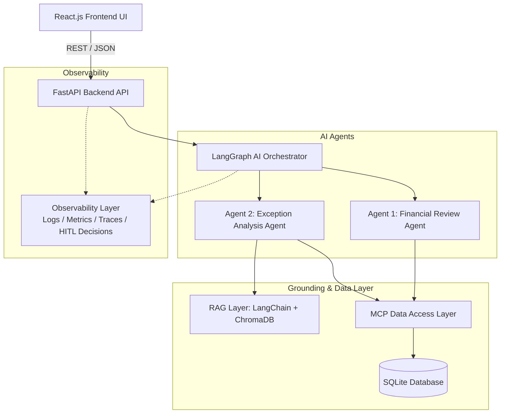

# ClosureIQ — AI-Powered Financial Close Assistant

> An academic AI capstone project built to accelerate and automate month-end financial closing workflows with deterministic financial validation, two collaborative AI agents, policy grounding via RAG, MCP-controlled data access, and mandatory Human-in-the-Loop approval gates.

---

## 1. Overview

During month-end close, accounting teams must reconcile general ledger transactions against bank feeds, validate expense accruals, verify fixed asset depreciation schedules, and resolve anomalies.

**ClosureIQ** provides an intelligent assistant that:
1. **Performs deterministic financial validations**: Exact GL-to-Bank reconciliations, accrual variance analysis, and depreciation schedules (never delegating financial math to LLMs).
2. **Detects financial exceptions**: Flags un-reconciled items, missing entries, and tolerance breaches.
3. **Employs two specialized AI agents**:
   - **Agent 1 (Financial Review Agent)**: Evaluates aggregate ledger health and period trends.
   - **Agent 2 (Exception Analysis Agent)**: Performs root-cause analysis on individual exceptions.
4. **Grounds recommendations via RAG**: Queries corporate accounting policies and SOPs from a ChromaDB vector store.
5. **Enforces Human-in-the-Loop (HITL)**: Requires explicit accountant approval before any journal adjustments are accepted.
6. **Maintains complete observability**: Logs run IDs, MCP tool executions, token usage, latencies, and human decisions.

---

## 2. MVP Financial Workflows

1. **GL-to-Bank Reconciliation**: Exact 1-to-1 matching and tolerance evaluation.
2. **Accrual Review**: Detecting missing accruals and period variance anomalies.
3. **Depreciation Validation**: Verifying straight-line schedule calculations against posted GL entries.

---

## 3. System Architecture



---

## 4. Technology Stack

| Layer | Technologies |
|---|---|
| **Backend & API** | Python 3.11, FastAPI, Pydantic v2, Uvicorn |
| **AI Orchestration & Agents** | LangGraph, Google Gemini API, LangChain |
| **Policy RAG** | ChromaDB (local persistence), LangChain |
| **Data Access** | Python MCP SDK (Model Context Protocol), SQLite |
| **Frontend UI** | React.js (Vite), Lucide Icons, Modern Vanilla CSS |
| **Testing** | Pytest, Pytest-Asyncio, HTTPX |
| **DevOps & Containers** | Docker, Docker Compose, Git & GitHub |

---

## 5. Repository & Directory Structure

```text
ClosureIQ/
│
├── backend/
│   ├── app/
│   │   ├── api/routes/         # FastAPI endpoints (health, reconciliation, exceptions, insights, approvals, observability)
│   │   ├── agents/             # Agent 1 (Financial Review) & Agent 2 (Exception Analysis)
│   │   ├── orchestrator/       # LangGraph graph, state, and workflow nodes
│   │   ├── financial_engine/   # Deterministic math: reconciliation, accrual, depreciation, exceptions
│   │   ├── rag/                # Document ingestion, vectorstore, and policy retriever
│   │   ├── mcp/                # MCP server and financial data tools
│   │   ├── database/           # SQLite connection, SQLAlchemy models, Pydantic schemas
│   │   ├── observability/      # Structured logging, metrics collector, run tracer
│   │   ├── services/           # HITL approval service
│   │   ├── config.py           # Application settings
│   │   └── main.py             # FastAPI app initialization
│   ├── tests/                  # Pytest test suite
│   ├── requirements.txt        # Python backend dependencies
│   ├── Dockerfile
│   └── .env.example
│
├── frontend/
│   ├── src/
│   │   ├── components/         # Header, Sidebar, MetricCard, StatusBadge
│   │   ├── pages/              # Dashboard, Reconciliation, Exceptions, Approvals, Observability
│   │   ├── layouts/            # MainLayout
│   │   ├── services/           # API and health service client
│   │   ├── hooks/              # Custom React hooks (useHealth)
│   │   ├── types/              # Frontend types & enums
│   │   ├── utils/              # Formatters & helpers
│   │   ├── App.jsx             # Root React component
│   │   └── main.jsx            # Entry point
│   ├── package.json
│   ├── vite.config.js
│   ├── Dockerfile
│   └── .env.example
│
├── data/
│   ├── financial/              # Mock transaction and statement datasets
│   ├── policies/               # Accounting SOPs and policy markdown documents
│   └── sample/                 # Sample test fixtures
│
├── scripts/
│   ├── seed_database.py        # Database setup and mock record seeder
│   └── ingest_policies.py      # Policy vectorization script
│
├── docs/                       # Architecture, API, Agent, RAG, MCP, and Telemetry specifications
├── docker-compose.yml
├── .gitignore
└── README.md
```

---

## 6. Team Ownership Matrix

| Area | Primary Developer Ownership | Files / Modules |
|---|---|---|
| **Backend / AI Architecture** | **Developer 1** | `backend/app/api`<br>`backend/app/agents/financial_review.py`<br>`backend/app/orchestrator`<br>`backend/app/mcp`<br>`backend/app/observability` |
| **Financial / RAG / Frontend** | **Developer 2** | `backend/app/financial_engine`<br>`backend/app/agents/exception_analysis.py`<br>`backend/app/rag`<br>`frontend`<br>`data` |

---

## 7. Development Setup & Quickstart

### Prerequisites
- Python 3.10+ (recommended 3.11)
- Node.js 18+ and npm
- Git

### 1. Backend Setup

```bash
# Navigate to backend directory
cd backend

# Create virtual environment
python -m venv .venv

# Activate virtual environment
# Windows (PowerShell):
.venv\Scripts\Activate.ps1
# Linux / macOS:
source .venv/bin/activate

# Install dependencies
pip install -r requirements.txt

# Configure environment variables
cp .env.example .env

# Run FastAPI dev server
uvicorn app.main:app --reload --port 8000
```
Backend will be live at `http://localhost:8000` with Swagger UI at `http://localhost:8000/docs`.

### 2. Frontend Setup

```bash
# Navigate to frontend directory
cd frontend

# Install dependencies
npm install

# Configure environment variables
cp .env.example .env

# Start Vite development server
npm run dev
```
Frontend will be live at `http://localhost:5173`.

### 3. Running Backend Tests

```bash
# Run pytest from backend directory
cd backend
pytest -v
```

---

## 8. Docker Quickstart (Alternative)

```bash
# From repository root
docker-compose up --build
```
- Frontend: `http://localhost:5173`
- Backend API: `http://localhost:8000`

---

## 9. Git Workflow

We adhere to a clean feature-branch development workflow:

```text
feature/<feature-name>  ──►  develop  ──►  main
```

### Typical Feature Branches:
- `feature/financial-engine`
- `feature/mcp`
- `feature/agent-1`
- `feature/agent-2`
- `feature/orchestrator`
- `feature/rag`
- `feature/react-ui`
- `feature/observability`
- `feature/hitl`
