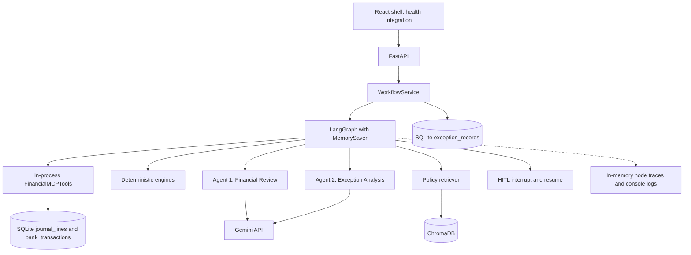
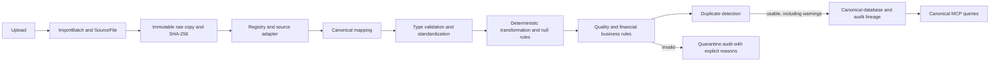
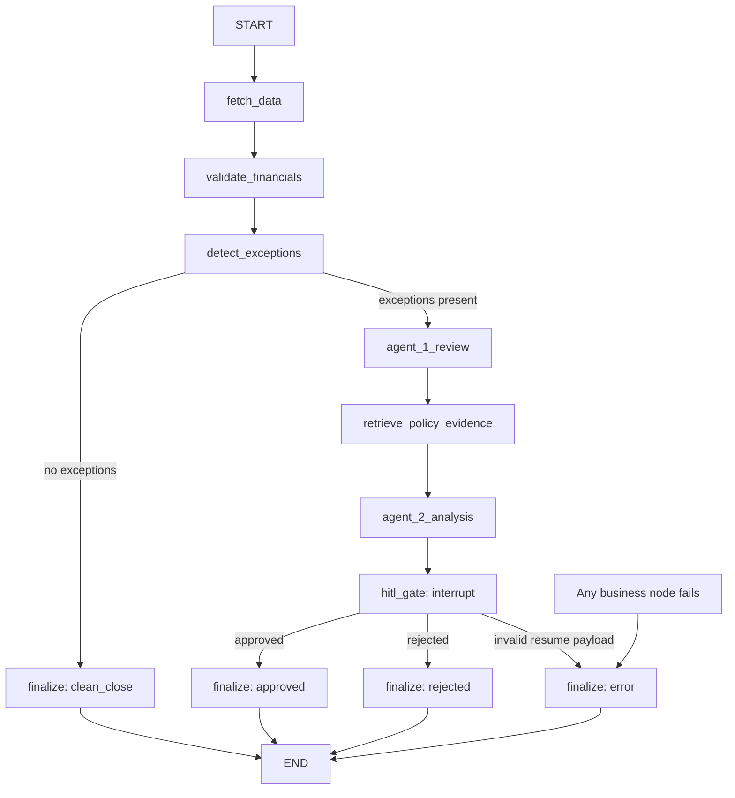
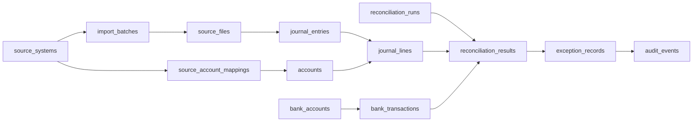

# ClosureIQ — Project Documentation

Updated for **Phase 2 - Adapters and Ingestion Pipeline**, 12 September 2026, on **`feature/generic-financial-database`**. The Git history table records the pre-Phase-2 baseline `d4d0738`; see `git log -1` for the local Phase 2 commit. This README is the existing main project document, updated instead of creating a duplicate `docs/PROJECT_DOCUMENTATION.md`.

**Implemented** means executable code exists at the stated boundary; **Partial** means working components have integration gaps; **Planned** means the behavior is absent. These labels do not imply production readiness or successful live ERP/Gemini validation.

## 1. Problem, MVP scope and use cases

Month-end close requires accountants to reconcile bank statements with ledger postings, identify missing/unusual accruals, validate depreciation, and explain exceptions against accounting policy. ClosureIQ is an academic capstone assistant combining deterministic checks, exactly two reasoning agents, policy retrieval and human review. It is not a replacement ERP or an autonomous journal-posting system.

The MVP covers GL-to-bank reconciliation, accrual review against supplied baselines, and straight-line depreciation validation against supplied postings. A common backend workflow detects exceptions, obtains Agent 1 review, retrieves policy evidence, invokes Agent 2 and pauses for approval. Financial calculations remain in Python engines, not model responses. Sources: [engines](backend/app/financial_engine/), [workflow service](backend/app/services/workflow_service.py), [agents](backend/app/agents/).

| Use case | Current capability |
|---|---|
| Accountant checks a bank account | Upload API/service imports canonical financial records; MCP reads canonical GL/bank data. React run/upload controls are not connected. |
| Accountant reviews accruals | API accepts entries and a caller-supplied baseline; no historical/AP extraction pipeline. |
| Accountant validates depreciation | Asset-register ingestion is implemented; depreciation review still accepts supplied parameters and posted amounts. |
| Reviewer investigates exceptions | Persisted exception list/detail endpoints and backend analysis exist; React viewer is a placeholder. |
| Reviewer approves/rejects | Backend checkpoint resume works; React controls and durable decision records are unfinished. |
| Evaluator examines evidence | Source, tests, graph traces and policy citations exist; dashboard figures are hardcoded examples. |

Sources: [API routes](backend/app/api/routes/), [React pages](frontend/src/pages/), [integration tests](backend/tests/integration/test_workflow_integration.py).

Main limitations: no browser import UI, no automatic journal posting, no one-to-many matching, no durable workflow checkpointing, no authenticated reviewer identity, and no complete telemetry dashboard. Ingestion validates organization/currency references and MCP queries are organization-scoped; end-user authentication and fully currency-aware workflows remain incomplete. Empty reconciliation inputs can return `clean_close`; that is not evidence of complete financial coverage.

## 2. Architecture and stack



This shows backend wiring, not completed UI workflows. The service calls `FinancialMCPTools` directly; no MCP transport round trip occurs in this path. Exception persistence and API queries also use SQLAlchemy directly. “All database access goes through MCP” would therefore be inaccurate. Sources: [service](backend/app/services/workflow_service.py), [exceptions route](backend/app/api/routes/exceptions.py).

| Layer | Technology and actual responsibility |
|---|---|
| Frontend | React 18, Vite 5, JavaScript, vanilla CSS, Lucide icons. Tab-based shell, health request and mostly static workflow pages. |
| HTTP backend | FastAPI, Uvicorn, Pydantic v2: validation, workflow dispatch, exception/approval/policy endpoints. |
| Database | SQLite through SQLAlchemy 2; canonical schema plus legacy financial model. |
| MCP | Requirements declare `mcp==2.1.1`; `MCPServer` registers GL query, bank query and exception detail tools. `get_account_balance` raises `NotImplementedError` and is not registered. No standalone transport launch command is supplied. |
| Orchestration | LangGraph `StateGraph`, Pydantic state, injected node dependencies, `interrupt`, `Command(resume=...)`, application-lifetime `MemorySaver`. |
| Two agents | Agent 1 classifies supplied exceptions while preserving engine severity. Agent 2 returns root-cause hypotheses and textual recommendations grounded in supplied evidence. Both use `google-genai`, default `gemini-2.5-flash`, structured response validation and separated system instructions/data. |
| RAG | Direct ChromaDB client, persistent `accounting_policies` collection, cosine distance, default Chroma embeddings and custom chunking/retrieval. LangChain/langchain-core are declared dependencies, but this RAG implementation is not a LangChain chain. |
| Observability | Console logger and node timings/errors in graph state. Metrics/tracer helpers exist; HTTP telemetry endpoints return placeholders. No complete persisted token/cost/HITL audit pipeline. |
| HITL | Whole-run approval/rejection changes workflow state; it does not post an adjustment. |
| Development | Python 3.11 and Node 20 container images; pytest, pytest-asyncio, HTTPX and Docker Compose. Most Python dependencies have lower bounds rather than a fully locked environment. |

Sources: [requirements](backend/requirements.txt), [frontend package](frontend/package.json), [config](backend/app/config.py), [MCP registration](backend/app/mcp/server.py), [graph](backend/app/orchestrator/graph.py), [agents](backend/app/agents/), [RAG](backend/app/rag/), [observability API](backend/app/api/routes/observability.py), [backend Dockerfile](backend/Dockerfile), [frontend Dockerfile](frontend/Dockerfile).

## 3. Components and folder structure

```text
ClosureIQ/
  README.md                       Existing main project document
  backend/
    app/
      main.py, config.py          Application lifespan, settings, CORS
      api/routes/                 Health, workflows, exceptions, approvals, RAG;
                                  insights/observability placeholders
      services/                   WorkflowService wiring, run state and locks;
                                  older ApprovalService helper is not the API path
      financial_engine/           Reconciliation, accrual, depreciation, exceptions
      agents/                     FinancialReviewAgent, ExceptionAnalysisAgent
      orchestrator/               State, node factories, conditional graph
      ingestion/                  Adapters, immutable storage, validation and import service
      mcp/                        Canonical SQLAlchemy-backed tools and SDK registration
      database/                   Engine/sessions, ORM models, response schemas
      rag/                        Extraction, chunking, Chroma, retrieval
      observability/              Logger, metrics and trace helpers
    tests/                        API, database, engines, MCP, agents, RAG,
                                  orchestrator and offline integration tests
    requirements.txt, Dockerfile, .env.example
  frontend/
    src/{components,layouts,pages,hooks,services,types,utils}/
    package.json, vite.config.js, Dockerfile, .env.example
  data/
    raw/enquest/                  Local ignored ERP samples; preserve originals
    policies/                     Tracked sample accounting policy
    financial/                    Placeholder for financial demo fixtures
    sample/                       Placeholder for sample fixtures
  scripts/
    seed_database.py              Destructive schema reset; no record inserts
    ingest_policies.py            Ingest repository policy directory
  docs/{architecture,agents,api,financial_engine,mcp,rag,observability}/
  Reference_Docs/                 Local ignored developer guide and walkthrough
  docker-compose.yml
  closureiq.db                    Local ignored root database
```

Raw files, reference documents, databases, `.env` and vector stores are ignored, so a fresh clone will not contain this workspace's data. `storage/raw/<batch_id>/<filename>` is now the default runtime upload store, protected against overwrites by exclusive file creation. Sources: [.gitignore](.gitignore), [financial placeholder](data/financial/.gitkeep), [sample placeholder](data/sample/.gitkeep).

## 4. End-to-end flows and application workflow branches

### Financial-file upload/import - Implemented backend; React UI planned

`POST /api/v1/imports/upload` accepts CSV/Excel bytes (up to 25 MiB), filename/source/organization query parameters and JSON adapter options in `X-Import-Options`. The same path is available through `IngestionService.ingest_file` or `ingest_path`. Register source systems, bank accounts and reviewed account mappings explicitly; ingestion does not invent account masters. Sources: [upload route](backend/app/api/routes/imports.py), [service](backend/app/ingestion/service.py), [walkthrough](walkthrough.md).



Financial row parsing/mapping/persistence is bounded by configurable chunks (default 500). Raw bytes remain size-limited in memory; OOXML uses read-only worksheets and binary XLS uses xlrd. Original files are never edited. Audit events preserve source-file/sheet/row references, control rows, warnings and quarantine reasons. A parse failure rolls back the file's canonical records while retaining raw evidence; row persistence failures use savepoints. See section 12 for contracts and limitations.

### Policy upload/RAG — Partial end to end; backend implemented

1. Submit JSON text to `POST /api/v1/rag/ingest/text`, or ingest a server directory through `/rag/ingest/directory` or `scripts/ingest_policies.py`. No browser file-upload UI or multipart upload endpoint exists.
2. Extract text/metadata and split sections/paragraphs with defaults of 600 characters and 80-character overlap. Delete existing chunks for the same `doc_id`, then index new chunks in Chroma.
3. `/rag/query` retrieves top-k evidence with an optional category filter and formatted citations. `/rag/documents` lists documents; `DELETE /rag/documents/{doc_id}` removes chunks.
4. The workflow retrieves three results per exception; an empty category search falls back to unrestricted retrieval. Evidence is passed to Agent 2 per exception.

Directory ingestion recognizes Markdown/text, PDF and DOC/DOCX extensions. PDF/Word extraction needs optional `pypdf`/`docx` packages not declared in requirements; missing imports trigger limited printable-text fallbacks. Reliable OCR/binary document extraction is not established. Same-ID replacement is not global content deduplication or immutable policy versioning. The tracked policy is sample material, not verified company policy. Sources: [ingestion](backend/app/rag/ingestion.py), [vectorstore](backend/app/rag/vectorstore.py), [retriever](backend/app/rag/retriever.py), [routes](backend/app/api/routes/rag.py), [sample policy](data/policies/sample_accounting_policy.md).

### Bank reconciliation — Partial end to end; canonical-data backend implemented

`POST /api/v1/reconciliation/run` accepts `workflow_type="reconciliation"`, `account_code`, optional `period`, `limit` and `run_id`. MCP reads canonical `journal_lines`/`journal_entries` joined to `accounts`, and `bank_transactions` joined through `bank_accounts.linked_gl_account_id`. Queries are organization-scoped (default `default_org`) and newest-first. GL signed amounts are derived as debit minus credit for the existing engine response contract, while original debit/credit strings and entry status are retained. Legacy `financial_records` are no longer read; existing legacy-only databases require migration/import before use. Default limit is 50, allowed range 1-100. The supplied period labels the workflow but **still does not filter transaction dates**. Draft ledger extracts can be queried; a matching result does not establish journal completeness.

Matching is greedy one-to-one: first normalized nonempty reference and amount within default 0.01, without checking dates; then amount within tolerance and a three-day window when both dates parse. Missing/unparseable dates permit amount-only fallback. Unmatched rows generate exceptions and enter analysis. The service does not persist canonical run/result rows or update reconciliation flags. Sources: [request schemas](backend/app/api/routes/reconciliation.py), [MCP tools](backend/app/mcp/tools.py), [engine](backend/app/financial_engine/reconciliation.py), [service](backend/app/services/workflow_service.py).

### Accrual review — Partial end to end; supplied-input backend implemented

The same run endpoint dispatches `workflow_type="accrual"` with nonempty `accrual_entries` and `historical_baseline`. The engine compares keyed expectations, detects material variance and missing recurring accruals, and creates exceptions. Default material variance requires more than 10% and at least 50 amount units. Baselines are supplied rather than calculated from imported history; no AP query is wired. Prefer vendor/account/name keys: the API accepts ID-only entries, but engine key extraction does not use `id`. Sources: [accrual engine](backend/app/financial_engine/accrual.py), [API](backend/app/api/routes/reconciliation.py), [dispatch](backend/app/services/workflow_service.py).

### Depreciation validation — Partial end to end; supplied-input backend implemented

Use `workflow_type="depreciation"`, nonempty `asset_records` and `period_posted_depreciation`. The engine calculates monthly `(cost - salvage_value) / useful_life_months`, handles invalid parameters/fully depreciated assets and compares expected/posted amounts with default tolerance 0.01. Discrepancies enter analysis. The ingestion service imports asset registers separately, but this workflow does not automatically query them or allocate category GL totals to assets, or implement a full acquisition/disposal/proration schedule. Use stable asset IDs: API-accepted asset-name-only inputs do not supply the engine's posting lookup ID. Sources: [engine](backend/app/financial_engine/depreciation.py), [API models](backend/app/api/routes/reconciliation.py).

### Exception analysis — Implemented backend; presentation/persistence partial

`ExceptionGenerator` converts engine output into categorized exceptions. Default amount severity is HIGH at 1,000, MEDIUM at 50, otherwise LOW, with supported overrides. The service persists basic fields before model calls, checking existing IDs and rolling back on persistence failure. Equivalent new runs generate new IDs, so this is not cross-run deduplication.

Agent 1 reviews exceptions and validation results; it does not independently fetch balances or calculate trends. RAG retrieves evidence for each exception. Agent 2 validates evidence indices and copies cited records into its response. Empty evidence skips its model call and returns manual review; a model response selecting no evidence also returns manual review. Invalid evidence indices/schema or provider failures raise errors. Recommendations are text, not validated debit/credit entries.

Full analyses/citations remain in graph state, but public workflow summaries expose reduced recommendations rather than the full evidence bundle. Persistence does not populate canonical exception run/result links or policy-evidence fields. Sources: [generator](backend/app/financial_engine/exceptions.py), [Agent 1](backend/app/agents/financial_review.py), [Agent 2](backend/app/agents/exception_analysis.py), [nodes](backend/app/orchestrator/nodes.py), [service](backend/app/services/workflow_service.py).

### Actual LangGraph paths and HITL — Implemented backend



Successful arrows are shown above; every business node (fetch, validate, detect, Agent 1, retrieval, Agent 2) has an error route to `finalize`. `route_after_detect` skips agents/HITL when clean. `route_after_hitl` always goes to the finalizer, which selects approved/rejected/error from state. These are application paths, independent of Git branches. Sources: [graph](backend/app/orchestrator/graph.py), [nodes](backend/app/orchestrator/nodes.py), [state](backend/app/orchestrator/state.py), [graph tests](backend/tests/orchestrator/test_orchestrator.py).

An interrupted run is reported as `hitl_pending`. `GET /api/v1/approvals/pending` lists paused runs; `POST /api/v1/approvals/{run_id}/decision` accepts `decision` (`approved`/`rejected`, case-insensitive), `reviewer` and `comments`, then resumes the same thread. Invalid decisions return 400, schema errors 422, missing runs 404, and completed/repeated resumes 409; duplicate run IDs also return 409. Per-run locks guard resumption. The node deliberately keeps `interrupt` outside broad exception handling.

Both decisions terminate the run. Neither posts journals, marks database exceptions RESOLVED, persists `AuditEvent`, nor restarts analysis after rejection. `requires_human_approval` is not an implemented bypass condition. Retry/revision loops, confidence-based auto-approval and durable recovery are unimplemented. One process/worker is required: `MemorySaver`, run summaries and locks do not survive restart or development reload. The older [ApprovalService](backend/app/services/approval_service.py) is not the active API dependency. Sources: [approval API](backend/app/api/routes/approvals.py), [service](backend/app/services/workflow_service.py), [integration tests](backend/tests/integration/test_workflow_integration.py).

## 5. Canonical database and adapter boundary

The current ORM defines **16 canonical tables plus one legacy table**. Read-only inspection found all 17 in this workspace's root `closureiq.db`, all empty. This does not describe another configured database. Definitions: [models](backend/app/database/models.py); sessions: [database.py](backend/app/database/database.py); tests: [canonical models](backend/tests/database/test_canonical_models.py).

| Table | Responsibility and declared relationships |
|---|---|
| `source_systems` | Organization, adapter key, feeder type/configuration; parent of batches and account mappings. |
| `import_batches` | Source-system FK, period, counts, validation/status; parent of files, referenced by imported financial entities. |
| `source_files` | Batch FK, original filename/raw path, SHA-256, size and parse status; referenced by journal entries. |
| `accounts` | Canonical COA, organization, normal balance, currency and optional self-parent. |
| `source_account_mappings` | Source-system account key/name to canonical account FK, mapping/reviewer status. |
| `journal_entries` | Voucher header, optional batch/file FKs, external ID, dates, period, currency/rate; parent of lines. |
| `journal_lines` | Entry/account FKs, debit/credit/base amounts, source row/running balance, dimensions and reconciliation flag. |
| `trial_balance_records` | Account/batch FKs; opening, period debit/credit and closing controls. |
| `bank_accounts` | Bank master, masked number/currency, optional linked GL account; parent of transactions. |
| `bank_transactions` | Bank-account/batch FKs, independent statement dates/signed amount/reference, source row and running balance. |
| `ap_invoices` | Vendor invoice dates, totals/payments/outstanding amount; optional batch and GL account FKs. |
| `fixed_assets` | Register cost, salvage, life, depreciation/book value; batch and cost/accumulated-depreciation/expense account FKs. |
| `reconciliation_runs` | Generalized check run, organization/period, GL/bank batch FKs, settings, summary and execution status. |
| `reconciliation_results` | Run FK; optional journal-line/bank-transaction/AP-invoice/asset FKs; expected/actual/variance, grouping, method and confidence. |
| `exception_records` | Result/run/journal-line/bank-transaction FKs, period/category/severity/variance, policy evidence and resolution fields. |
| `audit_events` | Optional run/batch/exception FKs, actor, event type, details and timestamp. `AuditTrailRecord` is a Python alias, not another table. |
| `financial_records` | Legacy flat GL/BANK model retained for schema compatibility; no longer used by MCP. Float amount, no canonical lineage. |



Arrows summarize declared references; ingestion populates source/batch/file/journal and audit links, while close-run/result persistence remains unfinished; optional links are listed in the table. Canonical monetary columns use `Numeric(18,4)`/Decimal, exchange rates `Numeric(18,6)`. Canonical transaction dates default to `None`; creation/audit timestamps default to now. Legacy transaction dates still default to now. UUID defaults coexist with explicitly supplied legacy-style exception IDs.

Phase 2 validates journal structure/balancing and organization/currency references in the ingestion service; model-level constraints remain incomplete for other direct writers. Audit metadata is not database-enforced immutable. Connection setup does not enable SQLite `PRAGMA foreign_keys=ON`; declared FKs alone do not establish runtime enforcement. Legacy storage, API inputs and engines still use floats. Source lineage is not equally granular for every domain. These qualify the stronger precision/lineage/tenancy claims in the [local walkthrough](Reference_Docs/walkthrough.md).

### Implemented Enquest mapping, keeping the schema generic

Enquest header/layout/account-identity handling stays inside [Enquest adapters](backend/app/ingestion/adapters/). Shared service/pipeline code handles canonical names only. The registry uses content/header detection or an explicit key; invalid explicit keys do not fall back. No new ERP-specific database models were added.

| Source element | Canonical destination |
|---|---|
| Filename stem | `account_name_raw`, resolved through source-scoped `SourceAccountMapping` in REVIEWED/AUTO_MAPPED state. No account auto-creation. |
| Voucher date/type/number | Journal entry date, type and external ID/number. Missing posting date remains null. |
| Ref/particulars/optional Remarks | Header reference/description; particulars and remarks can be deterministically combined. |
| Debit/credit, balance, currency/rate | Separate Decimal debit/credit, source running balance, currency/rate; base amounts derive from rate with explicit four-place rounding. No ingestion netting. |
| Cheque/CUIN-FDA/source reconciled marker | Line dimensions and original raw lineage. `is_reconciled` remains false. |
| Opening/subtotal/total/footer rows | Control audit events, excluded from journal lines. |
| Ledger transaction row | One explicitly partial DRAFT journal extract, not an invented balanced voucher. Cross-file journal reconstruction remains future work. |
| Trial balance account/Opening/Debit/Credit/Closing | Canonical TB record after mapping, configured fiscal period/currency and validation. Indented parent groups and All Account rows remain controls. Blank money is not inferred as zero. |
| Bank/AP/asset exports | Generic adapters write bank transactions, AP invoices and fixed assets using canonical fields and explicit master references. |

Lineage flows through `ImportBatch`/`SourceFile` to `JournalEntry`/`JournalLine`; other domain records link to batches, with detailed file/sheet/row-to-record references in `AuditEvent`. Source values remain in immutable raw files and audit lineage. See [service](backend/app/ingestion/service.py), [pipeline](backend/app/ingestion/pipeline.py).

## 6. Selected Enquest files and data provenance

The local selection contains **18 `.xls` files**. All **17 ledger exports were inspected as ZIP/OOXML workbooks despite their extensions**. They contain Ledger Inquiry/Voucher Wise report headings, ledger name/report period, opening rows, postings and debit/credit footer totals. Headers include Voucher Date, Particulars, Voucher Type, Voucher No, Ref No, Cheque No, Curr., Ex.Rate, Debit Amount, Credit Amount, Balance Amount, Is Bank Reconciliated and CUIN/FDA; some posting rows contain additional narration. Numeric Excel dates and floating-point-looking XML amount strings need explicit normalization. The Prime Bank heading covers 1 January–31 December 2025.

| Folder under `data/raw/enquest/` | Selected files | Evidence supported |
|---|---|---|
| `trial_balance/` | `Enquest TB 2025.xls` | Binary XLS decoded read-only with xlrd: Account/Opening/Debit/Credit/Closing headers, All Account control and indented groups/leaves. Report heading is 1 January?31 December 2025; this is a limited structural sample, not a completeness certification. |
| `bank_gl/` | `DIAMOND TRUST BANK KSHS.xls`; `DIAMOND TRUST BANK-KES CREDIT CARD.xls`; `PRIME BANK KSHS.xls` | ERP bank/cash postings and source reconciliation markers, **not independent bank statements**. |
| `accruals/` | `Accrual Expenses.xls`; `ACCRUALS-AUDIT FEES.xls` | Accrual postings/openings and invoice movements, not a complete obligation schedule/AP register. |
| `fixed_assets/` | `F-A COST MOTOR VEHICLES.xls`; `F-A COST OFFICE EQUIPMENT.xls`; `F-ACOST COMPUTERS & ACCESSORIES.xls` | Category cost ledgers; office equipment has an opening balance, not an itemized register. |
| `accumulated_depreciation/` | `ACC.DEP.COMPUTERS & ACCESSORIES.xls`; `ACC.DEP.MOTOR VEHICLES.xls`; `ACC.DEP.OFFICE EQUIPMENT.xls` | Category accumulated-depreciation postings and balances. |
| `depreciation_expense/` | `DEPRECIATION - MOTOR VEHICLES.xls`; `DEPRECIATION-COMPUTERS & ACCESSORIES.xls`; `DEPRECIATION-OFFICE EQUIPMENT.xls` | Category expense postings/recurring depreciation voucher references, not asset useful lives. |
| `counterpart_ledgers/` | `ASIF AMIN AC.xls`; `EXCHANGE GAIN-LOSS-REALISED.xls`; `OFFICE RENT EXPENSES.xls` | Selected counterpart, realized FX and rent context, not every voucher counterpart. |

These are **structural samples** for export formats, references, dates/amounts and account naming. Presence does not establish completeness, independent corroboration, authenticity certification or successful import. Some depreciation particulars/narration appear reused across categories; preserve and review those differences instead of inferring asset identity. They are not a complete verified close dataset. Source paths are listed in the table; raw files are locally ignored and were not changed.

Missing supporting data: independent bank statements and control balances; complete GL/COA and voucher counterparts; confirmed period/currency/rate semantics; AP invoices/service dates and recurring accrual expectations/prior-period baselines; an itemized asset register with acquisition/in-service dates, useful lives, salvage, disposals and prior depreciation; organization-approved policies and known expected outcomes.

**Synthetic demo data is planned** in `data/financial/`, with smaller fixtures in `data/sample/`; both currently contain only `.gitkeep`. Future fixtures should supply clearly synthetic bank statements, AP/baselines, asset schedules and controlled exceptions. Use separate source-system/batch identities and visible “SYNTHETIC DEMO” labels; this is a proposed provenance convention, not an implemented schema flag. Never present generated records as real ERP evidence. Existing tests use synthetic fixtures, and the tracked policy is sample material. The seed script inserts no records. Sources: [financial placeholder](data/financial/.gitkeep), [sample placeholder](data/sample/.gitkeep), [tests](backend/tests/), [policy](data/policies/sample_accounting_policy.md), [seed](scripts/seed_database.py).

## 7. Verified Git feature-branch history

Inspected `git status --short --branch`, `git branch -avv`, `git for-each-ref`, `git log --all --oneline --decorate`, and local/remote-tracking `--merged develop` results. “Origin” here means **locally stored remote-tracking refs**, not a fresh server query. This table captures the initial inspection before the local Phase 2 commit. No fetch, checkout or push was performed; live remote state and branch protection were not verified. The current tip is available through `git log -1`.

| Branch | Verified refs/tip | Purpose from commits | Merge status in inspected history |
|---|---|---|---|
| `main` | Local + origin: `e042b7c` | Repository foundation/skeleton/tests | Baseline ancestor of develop; later features are not in this tip. `origin/HEAD` points here. |
| `develop` | Local + origin: `2007bf0` | Shared feature integration | Includes merges #1–#7; not merged into current main. |
| `feature/mcp-layer` | Local + origin: `b1b3f18` | SQLite-backed MCP tools | In develop; PR #1 merge `a262555`. |
| `feature/financial-engine` | Local + origin: `450df3e` | Deterministic engines/exceptions | In develop; PR #2 merge `25a23c7`. |
| `feature/langgraph-orchestration` | Origin only: `35530ed` | Financial-close graph | In develop; PR #3 merge `92543e0`. |
| `feature/chroma-rag-pipeline` | Local + origin: `18ed357` | Ingestion, retrieval and policy API | In develop; PR #4 merge `b743bab`. |
| `feature/agent-1-financial-review` | Origin only: `dcdf30f` | Financial Review Agent | In develop; PR #5 merge `56d3dab`. |
| `feature/agent-2-exception-analysis` | Origin only: `8936f8b` | Exception Analysis Agent | In develop; PR #6 merge `612e87c`. |
| `feature/workflow-integration` | Origin only: `b4cb108` | Service/API close integration | In develop; PR #7 merge `2007bf0`. |
| **`feature/generic-financial-database` (current)** | Local only: **`d4d0738`**, no upstream | Phase 1 canonical schema/data organization | One commit beyond develop; not merged into develop/main. No corresponding origin ref; absence alone does not prove it was never pushed. |

Merged feature tips are also ancestors of the current branch. PR numbers come from merge messages; GitHub PR metadata was not independently queried. Earlier README “typical branches” and the [local developer guide](Reference_Docs/DEVELOPER_GUIDE.md) are proposals, not verified UI/telemetry/HITL branch history. No additional such refs were found. The [local walkthrough](Reference_Docs/walkthrough.md) says Phase 1 was uncommitted; Git now proves commit `d4d0738`.

## 8. Setup, database initialization and running

Commands were checked against repository modules/configuration. Spreadsheet dependencies were installed and backend tests executed for Phase 2; a clean full install, live server and Docker builds were not verified. Python 3.11 and Node 20 align with the Dockerfiles. Keep one backend worker.

### Backend: PowerShell from repository root

```powershell
cd backend
python -m venv .venv
.\.venv\Scripts\Activate.ps1
python -m pip install -r requirements.txt

# Select the root database explicitly from backend/.
$env:DATABASE_URL = 'sqlite:///../closureiq.db'
$env:CHROMA_PERSIST_DIRECTORY = './chroma_data'
$env:GEMINI_MODEL = 'gemini-2.5-flash'
# Set GEMINI_API_KEY in this shell for live model calls.
```

`Settings` reads environment variables but does not configure `env_file` or call `load_dotenv`. Copying `backend/.env.example` to `.env` alone does not load it. CORS overrides must be JSON lists, not the comma-separated example value; default CORS already includes localhost frontend addresses. SQLite/Chroma relative paths depend on working directory. Sources: [settings](backend/app/config.py), [example](backend/.env.example), [database](backend/app/database/database.py).

### Database initialization

FastAPI startup does not create tables. For a **new database**, with the intended URL set and from `backend/`, initialize without dropping tables:

```powershell
python -c "from app.database.database import Base, engine; import app.database.models; Base.metadata.create_all(bind=engine)"
```

`create_all` creates missing tables but does not migrate existing columns. No migration framework/script exists; an older database needs a separately designed migration and backup before use with changed models.

**Destructive seed warning:** [scripts/seed_database.py](scripts/seed_database.py) calls **`Base.metadata.drop_all(bind=engine)` followed by `create_all`**. It drops/recreates the modeled SQLite tables and **can erase imported financial data, exceptions and audit records**. It inserts no mock records despite its name/docstring. Do not use it for routine startup or safe initialization. Its invocation is `python ../scripts/seed_database.py` from `backend/`, only for an intentionally disposable database. It was not run in this review.

### Policies and backend server

```powershell
# Still in backend/, with the same environment settings.
python ../scripts/ingest_policies.py
python -m uvicorn app.main:app --host 127.0.0.1 --port 8000 --workers 1
```

Policy ingestion writes Chroma and may need the default embedding model available/downloaded; it is separate from financial ingestion. API docs: `http://localhost:8000/docs`. Health paths: `/health` and `/api/v1/health`; they do not verify imported data, database completeness or provider access. Development reload loses pending in-memory approvals. Sources: [policy script](scripts/ingest_policies.py), [main](backend/app/main.py), [health](backend/app/api/routes/health.py).

### Frontend: separate shell from repository root

```powershell
cd frontend
npm install
# If no .env exists, optionally copy .env.example to .env.
npm run dev
# Build check:
npm run build
```

Vite serves port 5173. `VITE_API_BASE_URL` defaults to `http://localhost:8000/api/v1`. The only dedicated API service beyond the generic fetch client is health; workflow pages do not call the workflow APIs. There is no frontend test script. Sources: [package](frontend/package.json), [Vite config](frontend/vite.config.js), [API client](frontend/src/services/api.js), [pages](frontend/src/pages/).

### API smoke examples

The following is **synthetic supplied input**, not ERP evidence. Submit through Swagger to `POST /api/v1/reconciliation/run`:

```json
{
  "workflow_type": "accrual",
  "period": "DEMO",
  "accrual_entries": [{"vendor": "demo-rent", "amount": 1000}],
  "historical_baseline": {"demo-rent": 1000}
}
```

Equal values exercise the clean branch; change the entry to 2000 for the exception branch, which requires Agent 1 model access. Query `/api/v1/reconciliation/summary?run_id=...`; when `hitl_pending`, submit to `/api/v1/approvals/{run_id}/decision`:

```json
{"decision":"approved","reviewer":"Demo reviewer","comments":"Synthetic scenario reviewed"}
```

Use `rejected` on a separate paused run; completed runs cannot be resumed again. Sources: [run request](backend/app/api/routes/reconciliation.py), [approval request](backend/app/api/routes/approvals.py).

### Docker

From root: `docker compose up --build`. Compose publishes ports 8000/5173 and mounts backend/data. It uses reload; SQLite is relative to `/app` (the backend mount), not this workspace's root database. Tables are not automatically initialized. Container builds and clean dependency installation were not verified here. Sources: [Compose](docker-compose.yml), [backend image](backend/Dockerfile), [frontend image](frontend/Dockerfile).

## 9. Tests and verification evidence

From `backend/` with dependencies installed:

```powershell
# Isolate import-time stores from application data.
$env:DATABASE_URL = 'sqlite:///:memory:'
$env:CHROMA_PERSIST_DIRECTORY = './chroma_data/phase2-tests'
python -m pytest tests -v -p no:cacheprovider

# Focused offline workflow integration:
python -m pytest tests/integration/test_workflow_integration.py -v -p no:cacheprovider
```

Restore application environment settings before starting the server. Use the ignored test-specific Chroma directory shown above. `:memory:` is supported as an explicit constructor argument, but the current environment-variable path does not select ephemeral mode and fails on Windows. Database fixtures use isolated in-memory SQLite engines. Sources: [vectorstore](backend/app/rag/vectorstore.py), [test fixtures](backend/tests/integration/test_workflow_integration.py).

| Area | Inspected coverage |
|---|---|
| Canonical schema | [10 model tests](backend/tests/database/test_canonical_models.py): tables, UUIDs, Decimal round trips, nullable dates, lineage, relationships, TB/AP/assets and compatibility. |
| Financial checks | [engine tests](backend/tests/financial_engine/test_engine.py): matching/tolerance/date windows, one-to-one use, missing accruals, depreciation and severity. |
| MCP | [tool tests](backend/tests/mcp/test_mcp.py): filters/order/limits, serialization, blocked balance tool, three registrations. |
| Agents | [agent tests](backend/tests/agents/test_agents.py): injected outputs, schema validation, prompt separation, error redaction, evidence/manual-review behavior. |
| Orchestration | [graph tests](backend/tests/orchestrator/test_orchestrator.py): dispatch, clean/error branches, per-exception evidence, approval/rejection and traces. |
| Integration | [offline suite](backend/tests/integration/test_workflow_integration.py): fake agents/retriever, real engines, isolated SQLite, HTTP validation, rollback, duplicate runs, resume conflicts and shared checkpoints. External sockets are blocked by its fixture. |
| RAG/health | [RAG tests](backend/tests/rag/test_rag.py), [health tests](backend/tests/api/test_health.py): ingestion/replacement, retrieval, document APIs and health. RAG uses Chroma embeddings and is not necessarily download-free. |

Phase 2 verification: the ingestion suite and complete backend suite were run (final counts are recorded in [walkthrough.md](walkthrough.md)). The local Phase 1 walkthrough's 196-pass claim is historical. Tests use synthetic files and isolated SQLite; the original root database and raw business files were not imported into or modified. Real-file inspection verified adapter detection/row parsing for all 18 selected Enquest files without persisting their contents. Live Gemini quality, browser workflows and container reproducibility remain unverified.

## 10. Project phases, dependencies, risks and next step

Phase 1 established the canonical schema. Phase 2 implements the user-approved adapter/ingestion pipeline. The older guide uses seven-day milestones; Phase 3+ numbers below are a **proposed implementation sequence**, not verified agreed milestones.

| Phase/workstream | Current status | Remaining work and dependencies |
|---|---|---|
| Existing MVP backend foundation | Partial overall; engines, two agents, RAG, graph/API integration implemented | UI, data integration and complete observability remain incomplete despite backend merges. |
| Phase 1 canonical schema/data organization | Implemented at model/test level on current branch | Canonical consumers, migrations/enforcement still needed; root database empty. |
| Phase 2: adapters and ingestion | Implemented backend | Upload/service, five adapters, storage/hash idempotency, validation, warnings/quarantine, canonical persistence, audit lineage and tests. Browser screens and distributed import coordination remain out of scope. |
| Phase 3: canonical workflows/data (proposed) | Engines implemented; integration planned | Independent bank/AP/asset inputs or labeled synthetic substitutes, automatic AP/asset workflow queries, period scoping, fully Decimal engine math and persisted close results. |
| Phase 4: UI/review integration (proposed) | Shell and backend HITL partial | Upload/mapping screens, working run controls, exception/evidence views, approval actions and error/empty states. |
| Phase 5: durable audit/evaluation (proposed) | Helpers/traces only | Durable checkpoints/decisions, authentication, telemetry, migrations, regression/evaluation scenarios and reproducible deployment/demo. |

Sources: [local walkthrough](Reference_Docs/walkthrough.md), [local developer guide](Reference_Docs/DEVELOPER_GUIDE.md), [models](backend/app/database/models.py), [service](backend/app/services/workflow_service.py), [frontend pages](frontend/src/pages/). Ignored local reference documents may be absent in other clones.

Key risks and dependencies:

- **Coverage:** selected ledger exports cannot independently prove bank matching, missing obligations or per-asset depreciation. Supporting data or explicitly synthetic substitutes are required.
- **Import ambiguity:** extensions, binary TB, Excel dates, opening rows, repeated vouchers, partial counterpart ledgers and numeric artifacts need parser fixtures and controls.
- **False assurance:** queries cap rows and ignore period; empty data can close cleanly. Source reconciliation markers and hardcoded UI metrics are not evaluation evidence.
- **Schema/runtime divergence:** canonical default currency is KES and run date window is seven days; legacy engines use floats, dollar-formatted descriptions and a three-day match window. Canonical run settings are not wired to engines.
- **Persistence:** restart loses approval state; close results/HITL audit are not persisted (ingestion audit is persisted). Migrations are absent and seed can erase data.
- **AI/RAG:** Gemini credentials/provider access and embedding availability are dependencies. Weak extraction or policy samples can undermine grounding; valid citation indices do not prove accounting correctness.
- **Access:** reviewer names are caller-supplied, tenant isolation is unfinished, and server-directory ingestion accepts paths without an implemented shared-deployment access/path policy.
- **Reproducibility:** broad dependency bounds, undeclared optional parsers and ignored local data prevent treating a fresh clone as a complete financial demo.

**Next implementation step:** wire the React upload/mapping and review screens to the import API, provide explicitly synthetic demo bank/AP/asset datasets, and connect imported AP/assets to close workflows with period controls. Complete-voucher reconstruction and durable HITL/close-result persistence remain separate work; no ERP postings are authorized by ingestion warnings or import success.

## 11. Earlier-document discrepancies and unverified facts

| Earlier claim | Code/Git evidence and correction |
|---|---|
| Complete telemetry/audit trail | [Observability routes](backend/app/api/routes/observability.py) are static; graph traces are not a complete durable audit pipeline. |
| Insights endpoint queues analysis | [Insights route](backend/app/api/routes/insights.py) returns a placeholder ID; real runs use `/reconciliation/run`. |
| Agent 1 computes aggregate ledger/trend review | [Agent contract](backend/app/agents/financial_review.py) reviews supplied exceptions/validation; balance tool is blocked. |
| Reference/date/amount always required | [Matching engine](backend/app/financial_engine/reconciliation.py) first ignores dates and later permits missing-date amount matching. |
| UI supports one-to-many matching/approval actions | [Pages](frontend/src/pages/) contain placeholder copy; engine is one-to-one. |
| Production persistent checkpointer | [Graph docstring](backend/app/orchestrator/graph.py) suggests one; [actual service](backend/app/services/workflow_service.py) uses MemorySaver. |
| Strict Decimal throughout; immutable raw/audit metadata | [Models](backend/app/database/models.py) add Numeric but legacy Float/engine float remain; immutability is not enforced. |
| Seed inserts fixtures | [Script](scripts/seed_database.py) only drops/recreates tables and prints messages. |
| Phase 1 uncommitted | Git proves `d4d0738`; live push status remains unverified. |

Unverified: ERP source completeness/authenticity; live remote refs/push status beyond stored tracking evidence; clean-install/build/container behavior; live Gemini access; other configured database contents; and a formally agreed Phase 3+ schedule. Synthetic ingestion is tested; no real-company close certification, live model evaluation or production readiness is claimed.

## 12. Phase 2 implementation contract

Entry points: [upload API](backend/app/api/routes/imports.py), `IngestionService.ingest_file(db, file_bytes, filename, ...)`, and `ingest_path(db, path, ...)`. Use a dedicated SQLAlchemy session. Existing source systems must be active and belong to the supplied organization; existing batches must match both source and organization. The service can create a generic runtime source when called without an ID, but the HTTP route requires a registered source ID.

### Adapters and detection

| Key | Supported input and mapping |
|---|---|
| `enquest_ledger` | OOXML including renamed `.xls`, and binary XLS; normalized headers across sheets, Excel dates, optional Remarks, row roles and separate posting amounts. Filename account identity requires a mapping. |
| `enquest_tb` | Excel TB Account/Opening/Debit/Credit/Closing columns, indented group controls, caller-supplied `fiscal_period` and `currency_code`. |
| `generic_bank` | CSV/Excel with exact normalized aliases; signed amount or deposit/withdrawal columns. Positive deposit, negative withdrawal; simultaneous nonzero sides are rejected as ambiguous rather than silently netted. Requires `bank_account_id` and currency in data/options. |
| `generic_ap_invoice` | CSV/Excel vendor/code, invoice/date/due date, subtotal/tax/total/paid/outstanding and status. Missing vendor/invoice IDs are errors, not generated placeholders. |
| `generic_fixed_asset` | CSV/Excel asset code/name/category, acquisition/in-service dates, cost/salvage/life/method/accumulated depreciation. Explicit month/year headers or `useful_life_unit` for ambiguous Useful Life; no magnitude-based unit guesses. |

Detection reads worksheet/CSV headers, not compressed ZIP text or filename keywords. Automatic detection scans up to 100 rows per sheet; explicit adapter selection parses the full file. CSV input is UTF-8/UTF-8-BOM with comma delimiters. Unsupported/malformed input has a failed file summary and retained raw evidence. Sources: [registry](backend/app/ingestion/adapters/registry.py), [tabular utilities](backend/app/ingestion/adapters/tabular.py), [adapters](backend/app/ingestion/adapters/).

### Validation, standardization and transformation

The [shared pipeline](backend/app/ingestion/pipeline.py) operates on canonical payloads. It validates dates, finite Decimals, amount precision/range, positive exchange rates, strings/identifiers, positive integer fields and booleans. It normalizes whitespace, currency aliases (`Rs`/`rs.` → `PKR`), ISO casing, supported entity statuses, categories and depreciation-method spelling. `value_replacements` and `defaults` are explicit, per-entity constructor configuration; no Enquest mappings are embedded in the service.

Required identifiers and non-null monetary fields are validated. Unknown optional dates remain null; missing transaction dates never become today's date. Missing money never becomes zero automatically. Missing subtotal/outstanding/book value may be derived only from known operands. A caller can supply deliberate defaults through an injected pipeline; those defaults must reflect an approved source contract. Zero is preserved as a value, not treated as missing. Amounts exceeding canonical precision are rejected instead of silently rounded; derived base journal amounts use explicit four-place Decimal rounding. Excel binary numeric representation can still carry source artifacts, which may need a reviewed source normalization policy.

Other deterministic transformations include journal reporting period, source/batch/file context, bank direction, and adapter-level column combination/splitting. There are no AI anomaly/fraud scores in ingestion.

### Financial rules and quarantine policy

| Outcome | Examples |
|---|---|
| Error → quarantine | `ERR_INVALID_DATE`, `ERR_INVALID_AMOUNT`, `ERR_AMOUNT_PRECISION`, `ERR_MISSING_FIELD`, `ERR_MISSING_ACCOUNT`, `ERR_NEGATIVE_AMOUNT`, `ERR_UNBALANCED_JOURNAL`, invalid integers/booleans/status/currency, missing/out-of-scope bank/account references. |
| Warning → retain record | `WARN_DUAL_SIDED_POSTING`, `WARN_POTENTIAL_BUSINESS_DUPLICATE`, `WARN_AP_DATE_INCONSISTENCY`, `WARN_ASSET_DATE_INCONSISTENCY`, invoice total/overpayment, asset salvage, TB control and base-amount discrepancies. |
| Partial journal → draft + warning | `WARN_INCOMPLETE_JOURNAL`: an account-ledger extract is not a complete voucher. The single posting remains DRAFT; no balancing counterpart is fabricated. Complete journals must balance exactly. |

Quarantine is represented by `INGEST_QUARANTINED` audit events, not duplicate financial models or an invalid-row financial table. `INGEST_CONTROL`, `INGEST_IMPORTED` and `INGEST_FILE_FAILED` events retain controls, successful record IDs and file failures. Audit details carry file/sheet/row lineage; imported payloads retain pre-standardization source context. Logs contain status/counts only, not financial row contents or SQL parameter dumps.

### Duplicates, persistence and summary

- **Technical file duplicate:** SHA-256 within the same source/organization and an already PARSED/QUARANTINED file returns `DUPLICATE`, with the existing batch/file IDs and no second import. Different sources are distinct import contexts. This protects replay even when the uploaded filename changes.
- **Technical row duplicate:** the same file/sheet/physical row identity within an import is skipped and counted. Different physical rows with identical financial values are not silently removed.
- **Business duplicate:** organization-scoped fingerprints compare persisted ingestion audit records, including previous chunks/files. Repeated vendor/invoice keys or similar bank/journal/asset fingerprints remain imported with `WARN_POTENTIAL_BUSINESS_DUPLICATE`. This is a review hint, not a fraud determination, and does not retroactively scan manually inserted legacy records.
- **Persistence:** reuses the Phase 1 journal, bank, AP, asset and TB models. Per-row savepoints isolate persistence failures; a late parse failure rolls back the file's financial records. Source data remains available for investigation.
- **Summary:** exposes `total_rows`, `valid_rows`, `quarantined_rows`, `warning_rows`, `duplicate_files`, `technical_duplicate_rows`, `business_duplicate_rows`, `skipped_rows`, `source_file_id` and `status`. Counts refer to mapped transaction rows; controls are skipped separately. Batch totals accumulate across files, retaining PARTIAL status when any file has errors. Inline diagnostics are capped at 100 errors and 100 warnings; full row diagnostics remain in audit events. Statuses include COMPLETED, PARTIAL, QUARANTINED, FAILED and replay-only DUPLICATE.

Runtime raw copies use exclusive creation and path validation. This prevents service-level overwrite/path traversal; it is not OS-enforced WORM storage. The process lock serializes imports in the current single-worker deployment; cross-process duplicate races need database uniqueness/locking before scaling. Same-hash quarantined-file replay currently returns DUPLICATE; a controlled reprocessing workflow is not implemented. The input-byte cap and row chunks bound routine processing, but binary workbook libraries can retain workbook structures in memory.

Legacy model definitions remain for compatibility, but downstream MCP now queries canonical financial tables only. Close engines and agents receive canonical tool output and contain no Enquest header/layout logic. The existing engines still use floats and the workflow still accepts supplied accrual/depreciation inputs; Phase 2 does not claim to complete those later integrations. See [walkthrough.md](walkthrough.md) for reproducible synthetic examples and verification results.
