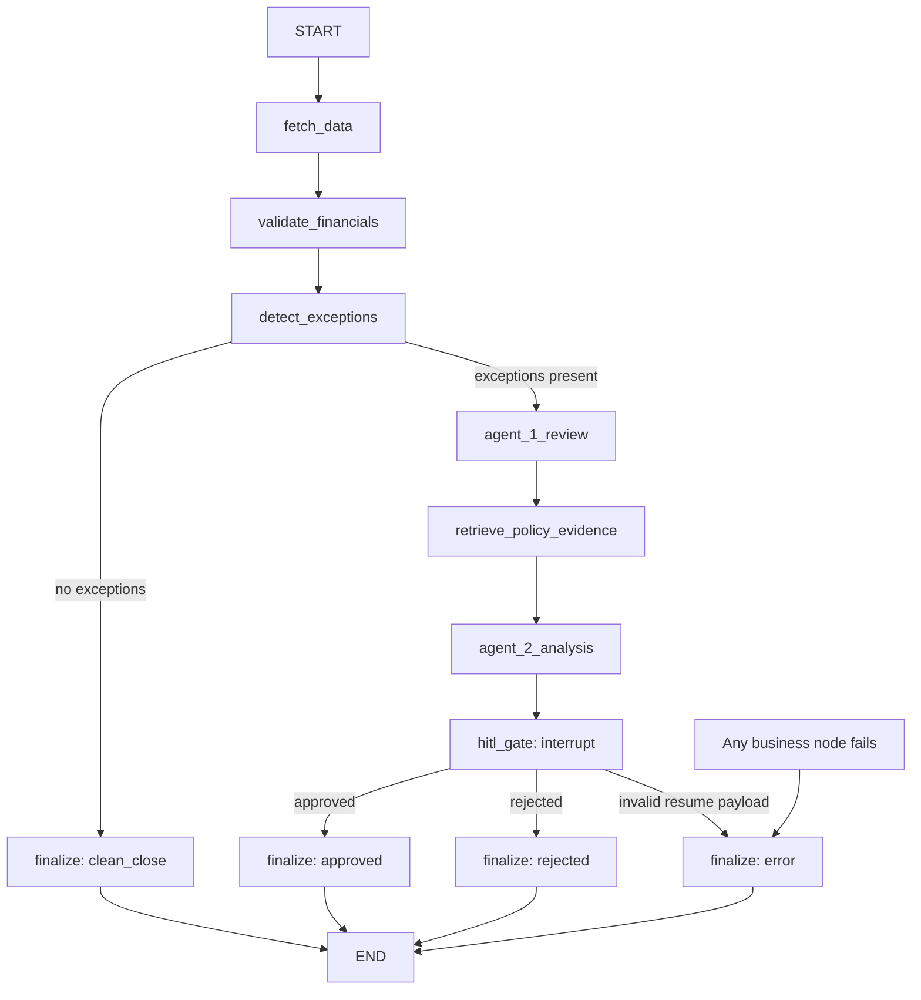

# Agents, orchestration and human review

[Project entry point](../../README.md) | [Architecture and setup](../architecture/overview.md) | [Ingestion](../ingestion/pipeline.md)

Exactly two agents use `google-genai` (default `gemini-2.5-flash`) with validated structured output and separate system instructions and supplied data. Financial calculations belong to deterministic engines.

| Component | Current responsibility |
|---|---|
| Agent 1: Financial Review | Reviews supplied exceptions and validation output; preserves engine severity. It does not independently compute trends or fetch account balances. |
| Agent 2: Exception Analysis | Produces root-cause hypotheses and textual recommendations using supplied policy evidence; validates citation indices. Recommendations are not validated journal entries. |
| LangGraph / WorkflowService | Fetches canonical tool data, runs engines, routes clean/error/exception outcomes and manages in-memory approval checkpoints. |

Sources: [Agent 1](../../backend/app/agents/financial_review.py), [Agent 2](../../backend/app/agents/exception_analysis.py), [service](../../backend/app/services/workflow_service.py).

## Exception analysis — Implemented backend; presentation/persistence partial

`ExceptionGenerator` converts engine output into categorized exceptions. Default amount severity is HIGH at 1,000, MEDIUM at 50, otherwise LOW, with supported overrides. The service persists basic fields before model calls, checking existing IDs and rolling back on persistence failure. Equivalent new runs generate new IDs, so this is not cross-run deduplication.

Agent 1 reviews exceptions and validation results; it does not independently fetch balances or calculate trends. RAG retrieves evidence for each exception. Agent 2 validates evidence indices and copies cited records into its response. Empty evidence skips its model call and returns manual review; a model response selecting no evidence also returns manual review. Invalid evidence indices/schema or provider failures raise errors. Recommendations are text, not validated debit/credit entries.

Full analyses/citations remain in graph state, but public workflow summaries expose reduced recommendations rather than the full evidence bundle. Persistence does not populate canonical exception run/result links or policy-evidence fields. Sources: [generator](../../backend/app/financial_engine/exceptions.py), [Agent 1](../../backend/app/agents/financial_review.py), [Agent 2](../../backend/app/agents/exception_analysis.py), [nodes](../../backend/app/orchestrator/nodes.py), [service](../../backend/app/services/workflow_service.py).

## Actual LangGraph paths and HITL — Implemented backend

Successful arrows are shown above; every business node (fetch, validate, detect, Agent 1, retrieval, Agent 2) has an error route to `finalize`. `route_after_detect` skips agents/HITL when clean. `route_after_hitl` always goes to the finalizer, which selects approved/rejected/error from state. These are application paths, independent of Git branches. Sources: [graph](../../backend/app/orchestrator/graph.py), [nodes](../../backend/app/orchestrator/nodes.py), [state](../../backend/app/orchestrator/state.py), [graph tests](../../backend/tests/orchestrator/test_orchestrator.py).

An interrupted run is reported as `hitl_pending`. `GET /api/v1/approvals/pending` lists paused runs; `POST /api/v1/approvals/{run_id}/decision` accepts `decision` (`approved`/`rejected`, case-insensitive), `reviewer` and `comments`, then resumes the same thread. Invalid decisions return 400, schema errors 422, missing runs 404, and completed/repeated resumes 409; duplicate run IDs also return 409. Per-run locks guard resumption. The node deliberately keeps `interrupt` outside broad exception handling.

Both decisions terminate the run. Neither posts journals, marks database exceptions RESOLVED, persists `AuditEvent`, nor restarts analysis after rejection. `requires_human_approval` is not an implemented bypass condition. Retry/revision loops, confidence-based auto-approval and durable recovery are unimplemented. One process/worker is required: `MemorySaver`, run summaries and locks do not survive restart or development reload. The older [ApprovalService](../../backend/app/services/approval_service.py) is not the active API dependency. Sources: [approval API](../../backend/app/api/routes/approvals.py), [service](../../backend/app/services/workflow_service.py), [integration tests](../../backend/tests/integration/test_workflow_integration.py).

The previous specification described broader trend analysis and suggested adjustment entries as current behavior. The contracts above reflect implemented code. See [financial rules](../financial_engine/rules.md), [RAG](../rag/pipeline.md) and [telemetry](../observability/telemetry.md).
