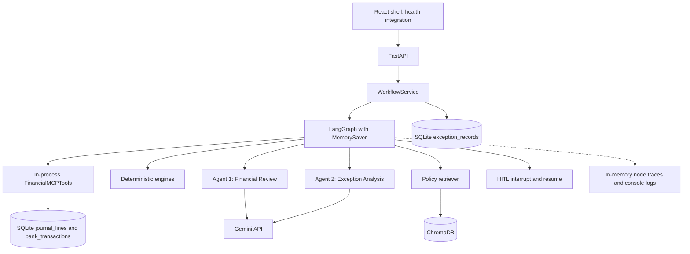
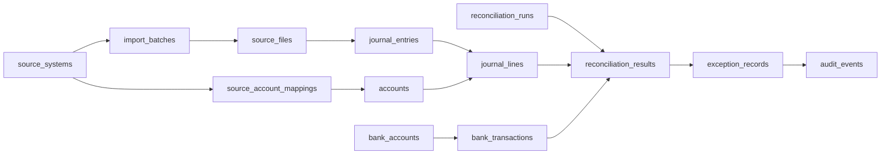

# ClosureIQ architecture and developer guide

[Project entry point](../../README.md) | [Architecture and setup](overview.md) | [Ingestion](../ingestion/pipeline.md)

Implementation baseline: Phase 2 commit `6083bb8`. **Implemented** means executable code exists at the stated boundary; **Partial** identifies integration gaps; **Planned** means absent. Test results and local data observations below are historical inspection evidence, not live deployment guarantees.

## Problem, MVP scope and use cases

Month-end close requires accountants to reconcile bank statements with ledger postings, identify missing/unusual accruals, validate depreciation, and explain exceptions against accounting policy. ClosureIQ is an academic capstone assistant combining deterministic checks, exactly two reasoning agents, policy retrieval and human review. It is not a replacement ERP or an autonomous journal-posting system.

The MVP covers GL-to-bank reconciliation, accrual review against supplied baselines, and straight-line depreciation validation against supplied postings. A common backend workflow detects exceptions, obtains Agent 1 review, retrieves policy evidence, invokes Agent 2 and pauses for approval. Financial calculations remain in Python engines, not model responses. Sources: [engines](../../backend/app/financial_engine), [workflow service](../../backend/app/services/workflow_service.py), [agents](../../backend/app/agents).

| Use case | Current capability |
|---|---|
| Accountant checks a bank account | Upload API/service imports canonical financial records; MCP reads canonical GL/bank data. React run/upload controls are not connected. |
| Accountant reviews accruals | API accepts entries and a caller-supplied baseline; no historical/AP extraction pipeline. |
| Accountant validates depreciation | Asset-register ingestion is implemented; depreciation review still accepts supplied parameters and posted amounts. |
| Reviewer investigates exceptions | Persisted exception list/detail endpoints and backend analysis exist; React viewer is a placeholder. |
| Reviewer approves/rejects | Backend checkpoint resume works; React controls and durable decision records are unfinished. |
| Evaluator examines evidence | Source, tests, graph traces and policy citations exist; dashboard figures are hardcoded examples. |

Sources: [API routes](../../backend/app/api/routes), [React pages](../../frontend/src/pages), [integration tests](../../backend/tests/integration/test_workflow_integration.py).

Main limitations: no browser import UI, no automatic journal posting, no one-to-many matching, no durable workflow checkpointing, no authenticated reviewer identity, and no complete telemetry dashboard. Ingestion validates organization/currency references and MCP queries are organization-scoped; end-user authentication and fully currency-aware workflows remain incomplete. Empty reconciliation inputs can return `clean_close`; that is not evidence of complete financial coverage.

## Architecture and stack



This shows backend wiring, not completed UI workflows. The service calls `FinancialMCPTools` directly; no MCP transport round trip occurs in this path. Exception persistence and API queries also use SQLAlchemy directly. “All database access goes through MCP” would therefore be inaccurate. Sources: [service](../../backend/app/services/workflow_service.py), [exceptions route](../../backend/app/api/routes/exceptions.py).

| Layer | Technology and actual responsibility |
|---|---|
| Frontend | React 18, Vite 5, JavaScript, vanilla CSS, Lucide icons. Tab-based shell, health request and mostly static workflow pages. |
| HTTP backend | FastAPI, Uvicorn, Pydantic v2: validation, workflow dispatch, exception/approval/policy endpoints. |
| Database | SQLite through SQLAlchemy 2; canonical schema plus legacy financial model. |
| MCP | Requirements declare `mcp==2.1.1`; `MCPServer` registers GL query, bank query and exception detail tools. `get_account_balance` raises `NotImplementedError` and is not registered. No standalone transport launch command is supplied. |
| Orchestration | LangGraph `StateGraph`, Pydantic state, injected node dependencies, `interrupt`, `Command(resume=...)`, application-lifetime `MemorySaver`. |
| Two agents | Agent 1 classifies supplied exceptions while preserving engine severity. Agent 2 returns root-cause hypotheses and textual recommendations grounded in supplied evidence. Both use `google-genai`, default `gemini-2.5-flash`, structured response validation and separated system instructions/data. |
| RAG | Direct ChromaDB client, persistent `accounting_policies` collection, cosine distance, default Chroma embeddings and custom chunking/retrieval. LangChain/langchain-core are declared dependencies, but this RAG implementation is not a LangChain chain. |
| Observability | Console logger and node timings/errors in graph state. Metrics/tracer helpers exist; HTTP telemetry endpoints return placeholders. No complete persisted token/cost/HITL audit pipeline. |
| HITL | Whole-run approval/rejection changes workflow state; it does not post an adjustment. |
| Development | Python 3.11 and Node 20 container images; pytest, pytest-asyncio, HTTPX and Docker Compose. Most Python dependencies have lower bounds rather than a fully locked environment. |

Sources: [requirements](../../backend/requirements.txt), [frontend package](../../frontend/package.json), [config](../../backend/app/config.py), [MCP registration](../../backend/app/mcp/server.py), [graph](../../backend/app/orchestrator/graph.py), [agents](../../backend/app/agents), [RAG](../../backend/app/rag), [observability API](../../backend/app/api/routes/observability.py), [backend Dockerfile](../../backend/Dockerfile), [frontend Dockerfile](../../frontend/Dockerfile).

## Components and folder structure

```text
ClosureIQ/
  README.md                       Concise developer entry point
  backend/
    app/
      main.py, config.py          Application lifespan, settings, CORS
      api/routes/                 Health, imports, workflows, exceptions, approvals, RAG;
                                  insights/observability placeholders
      services/                   WorkflowService wiring, run state and locks;
                                  older ApprovalService helper is not the API path
      financial_engine/           Reconciliation, accrual, depreciation, exceptions
      agents/                     FinancialReviewAgent, ExceptionAnalysisAgent
      orchestrator/               State, node factories, conditional graph
      ingestion/                  Adapters, protected raw storage, validation and import service
      mcp/                        Canonical SQLAlchemy-backed tools and SDK registration
      database/                   Engine/sessions, ORM models, response schemas
      rag/                        Extraction, chunking, Chroma, retrieval
      observability/              Logger, metrics and trace helpers
    tests/                        API, database, engines, MCP, agents, RAG,
                                  orchestrator and offline integration tests
    requirements.txt, Dockerfile, .env.example
  frontend/
    src/{components,layouts,pages,hooks,services,types,utils}/
    package.json, vite.config.js, Dockerfile, .env.example
  data/
    raw/enquest/                  Local ignored ERP samples; preserve originals
    policies/                     Tracked sample accounting policy
    financial/                    Placeholder for financial demo fixtures
    sample/                       Placeholder for sample fixtures
  scripts/
    seed_database.py              Destructive schema reset; no record inserts
    ingest_policies.py            Ingest repository policy directory
  docs/{architecture,agents,api,financial_engine,mcp,rag,observability,ingestion}/
  Reference_Docs/                 Local ignored developer guide and walkthrough
  docker-compose.yml
  closureiq.db                    Local ignored root database
```

Raw files, reference documents, databases, `.env` and vector stores are ignored, so a fresh clone will not contain this workspace's data. `storage/raw/<batch_id>/<filename>` is now the default runtime upload store, protected against overwrites by exclusive file creation. Sources: [.gitignore](../../.gitignore), [financial placeholder](../../data/financial/.gitkeep), [sample placeholder](../../data/sample/.gitkeep).

## Canonical database and adapter boundary

The current ORM defines **16 canonical tables plus one legacy table**. Read-only inspection found all 17 in this workspace's root `closureiq.db`, all empty. This does not describe another configured database. Definitions: [models](../../backend/app/database/models.py); sessions: [database.py](../../backend/app/database/database.py); tests: [canonical models](../../backend/tests/database/test_canonical_models.py).

| Table | Responsibility and declared relationships |
|---|---|
| `source_systems` | Organization, adapter key, feeder type/configuration; parent of batches and account mappings. |
| `import_batches` | Source-system FK, period, counts, validation/status; parent of files, referenced by imported financial entities. |
| `source_files` | Batch FK, original filename/raw path, SHA-256, size and parse status; referenced by journal entries. |
| `accounts` | Canonical COA, organization, normal balance, currency and optional self-parent. |
| `source_account_mappings` | Source-system account key/name to canonical account FK, mapping/reviewer status. |
| `journal_entries` | Voucher header, optional batch/file FKs, external ID, dates, period, currency/rate; parent of lines. |
| `journal_lines` | Entry/account FKs, debit/credit/base amounts, source row/running balance, dimensions and reconciliation flag. |
| `trial_balance_records` | Account/batch FKs; opening, period debit/credit and closing controls. |
| `bank_accounts` | Bank master, masked number/currency, optional linked GL account; parent of transactions. |
| `bank_transactions` | Bank-account/batch FKs, independent statement dates/signed amount/reference, source row and running balance. |
| `ap_invoices` | Vendor invoice dates, totals/payments/outstanding amount; optional batch and GL account FKs. |
| `fixed_assets` | Register cost, salvage, life, depreciation/book value; batch and cost/accumulated-depreciation/expense account FKs. |
| `reconciliation_runs` | Generalized check run, organization/period, GL/bank batch FKs, settings, summary and execution status. |
| `reconciliation_results` | Run FK; optional journal-line/bank-transaction/AP-invoice/asset FKs; expected/actual/variance, grouping, method and confidence. |
| `exception_records` | Result/run/journal-line/bank-transaction FKs, period/category/severity/variance, policy evidence and resolution fields. |
| `audit_events` | Optional run/batch/exception FKs, actor, event type, details and timestamp. `AuditTrailRecord` is a Python alias, not another table. |
| `financial_records` | Legacy flat GL/BANK model retained for schema compatibility; no longer used by MCP. Float amount, no canonical lineage. |



Arrows summarize declared references; ingestion populates source/batch/file/journal and audit links, while close-run/result persistence remains unfinished; optional links are listed in the table. Canonical monetary columns use `Numeric(18,4)`/Decimal, exchange rates `Numeric(18,6)`. Canonical transaction dates default to `None`; creation/audit timestamps default to now. Legacy transaction dates still default to now. UUID defaults coexist with explicitly supplied legacy-style exception IDs.

Phase 2 validates journal structure/balancing and organization/currency references in the ingestion service; model-level constraints remain incomplete for other direct writers. Audit metadata is not database-enforced immutable. Connection setup does not enable SQLite `PRAGMA foreign_keys=ON`; declared FKs alone do not establish runtime enforcement. Legacy storage, API inputs and engines still use floats. Source lineage is not equally granular for every domain. These qualify the stronger precision/lineage/tenancy claims in the `Reference_Docs/walkthrough.md` (ignored local reference).

## Workflow guides

- [Imports, source mappings and Enquest provenance](../ingestion/pipeline.md)
- [Financial reconciliation, accrual and depreciation](../financial_engine/rules.md)
- [Exception analysis, LangGraph branches and HITL](../agents/specifications.md)
- [Policy ingestion and retrieval](../rag/pipeline.md)
- [API contracts](../api/endpoints.md)
- [MCP contracts](../mcp/tools.md)
- [Telemetry and audit limits](../observability/telemetry.md)

## Verified Git feature-branch history

Inspected local branches, remote-tracking refs and commit history. Origin means locally stored remote-tracking refs, not a fresh server query. The current branch and its origin tracking ref both point to `6083bb8`; it contains Phase 1 (`d4d0738`) and Phase 2 (`6083bb8`) beyond develop. No fetch or push was performed during this documentation update; live remote state and branch protection were not verified.

| Branch | Verified refs/tip | Purpose from commits | Merge status in inspected history |
|---|---|---|---|
| `main` | Local + origin: `e042b7c` | Repository foundation/skeleton/tests | Baseline ancestor of develop; later features are not in this tip. `origin/HEAD` points here. |
| `develop` | Local + origin: `2007bf0` | Shared feature integration | Includes merges #1–#7; not merged into current main. |
| `feature/mcp-layer` | Local + origin: `b1b3f18` | SQLite-backed MCP tools | In develop; PR #1 merge `a262555`. |
| `feature/financial-engine` | Local + origin: `450df3e` | Deterministic engines/exceptions | In develop; PR #2 merge `25a23c7`. |
| `feature/langgraph-orchestration` | Origin only: `35530ed` | Financial-close graph | In develop; PR #3 merge `92543e0`. |
| `feature/chroma-rag-pipeline` | Local + origin: `18ed357` | Ingestion, retrieval and policy API | In develop; PR #4 merge `b743bab`. |
| `feature/agent-1-financial-review` | Origin only: `dcdf30f` | Financial Review Agent | In develop; PR #5 merge `56d3dab`. |
| `feature/agent-2-exception-analysis` | Origin only: `8936f8b` | Exception Analysis Agent | In develop; PR #6 merge `612e87c`. |
| `feature/workflow-integration` | Origin only: `b4cb108` | Service/API close integration | In develop; PR #7 merge `2007bf0`. |
| **`feature/generic-financial-database` (current)** | Local + origin: **`6083bb8`**, tracking origin | Phase 1 canonical schema and Phase 2 ingestion | Two commits beyond develop; not merged into develop/main in inspected history. |

Merged feature tips are also ancestors of the current branch. PR numbers come from merge messages; GitHub PR metadata was not independently queried. Earlier README “typical branches” and the `Reference_Docs/DEVELOPER_GUIDE.md` (ignored local reference) are proposals, not verified UI/telemetry/HITL branch history. No additional such refs were found. The `Reference_Docs/walkthrough.md` (ignored local reference) says Phase 1 was uncommitted; Git now proves commit `d4d0738`.

## Setup, database initialization and running

Commands were checked against repository modules/configuration. Spreadsheet dependencies were installed and backend tests executed for Phase 2; a clean full install, live server and Docker builds were not verified. Python 3.11 and Node 20 align with the Dockerfiles. Keep one backend worker.

### Backend: PowerShell from repository root

```powershell
cd backend
python -m venv .venv
.\.venv\Scripts\Activate.ps1
python -m pip install -r requirements.txt

# Select the root database explicitly from backend/.
$env:DATABASE_URL = 'sqlite:///../closureiq.db'
$env:CHROMA_PERSIST_DIRECTORY = './chroma_data'
$env:GEMINI_MODEL = 'gemini-2.5-flash'
# Set GEMINI_API_KEY in this shell for live model calls.
```

`Settings` reads environment variables but does not configure `env_file` or call `load_dotenv`. Copying `backend/.env.example` to `.env` alone does not load it. CORS overrides must be JSON lists, not the comma-separated example value; default CORS already includes localhost frontend addresses. SQLite/Chroma relative paths depend on working directory. Sources: [settings](../../backend/app/config.py), [example](../../backend/.env.example), [database](../../backend/app/database/database.py).

### Database initialization

FastAPI startup does not create tables. For a **new database**, with the intended URL set and from `backend/`, initialize without dropping tables:

```powershell
python -c "from app.database.database import Base, engine; import app.database.models; Base.metadata.create_all(bind=engine)"
```

`create_all` creates missing tables but does not migrate existing columns. No migration framework/script exists; an older database needs a separately designed migration and backup before use with changed models.

**Destructive seed warning:** [scripts/seed_database.py](../../scripts/seed_database.py) calls **`Base.metadata.drop_all(bind=engine)` followed by `create_all`**. It drops/recreates the modeled SQLite tables and **can erase imported financial data, exceptions and audit records**. It inserts no mock records despite its name/docstring. Do not use it for routine startup or safe initialization. Its invocation is `python ../scripts/seed_database.py` from `backend/`, only for an intentionally disposable database. It was not run in this review.

### Policies and backend server

```powershell
# Still in backend/, with the same environment settings.
python ../scripts/ingest_policies.py
python -m uvicorn app.main:app --host 127.0.0.1 --port 8000 --workers 1
```

Policy ingestion writes Chroma and may need the default embedding model available/downloaded; it is separate from financial ingestion. API docs: `http://localhost:8000/docs`. Health paths: `/health` and `/api/v1/health`; they do not verify imported data, database completeness or provider access. Development reload loses pending in-memory approvals. Sources: [policy script](../../scripts/ingest_policies.py), [main](../../backend/app/main.py), [health](../../backend/app/api/routes/health.py).

### Frontend: separate shell from repository root

```powershell
cd frontend
npm install
# If no .env exists, optionally copy .env.example to .env.
npm run dev
# Build check:
npm run build
```

Vite serves port 5173. `VITE_API_BASE_URL` defaults to `http://localhost:8000/api/v1`. The only dedicated API service beyond the generic fetch client is health; workflow pages do not call the workflow APIs. There is no frontend test script. Sources: [package](../../frontend/package.json), [Vite config](../../frontend/vite.config.js), [API client](../../frontend/src/services/api.js), [pages](../../frontend/src/pages).

See [API examples](../api/endpoints.md#synthetic-workflow-example) for supplied-input runs and approval requests.

### Docker

From root: `docker compose up --build`. Compose publishes ports 8000/5173 and mounts backend/data. It uses reload; SQLite is relative to `/app` (the backend mount), not this workspace's root database. Tables are not automatically initialized. Container builds and clean dependency installation were not verified here. Sources: [Compose](../../docker-compose.yml), [backend image](../../backend/Dockerfile), [frontend image](../../frontend/Dockerfile).

## Tests and verification evidence

From `backend/` with dependencies installed:

```powershell
# Isolate import-time stores from application data.
$env:DATABASE_URL = 'sqlite:///:memory:'
$env:CHROMA_PERSIST_DIRECTORY = './chroma_data/phase2-tests'
python -m pytest tests -v -p no:cacheprovider

# Focused offline workflow integration:
python -m pytest tests/integration/test_workflow_integration.py -v -p no:cacheprovider
```

Restore application environment settings before starting the server. Use the ignored test-specific Chroma directory shown above. `:memory:` is supported as an explicit constructor argument, but the current environment-variable path does not select ephemeral mode and fails on Windows. Database fixtures use isolated in-memory SQLite engines. Sources: [vectorstore](../../backend/app/rag/vectorstore.py), [test fixtures](../../backend/tests/integration/test_workflow_integration.py).

| Area | Inspected coverage |
|---|---|
| Canonical schema | [10 model tests](../../backend/tests/database/test_canonical_models.py): tables, UUIDs, Decimal round trips, nullable dates, lineage, relationships, TB/AP/assets and compatibility. |
| Financial checks | [engine tests](../../backend/tests/financial_engine/test_engine.py): matching/tolerance/date windows, one-to-one use, missing accruals, depreciation and severity. |
| MCP | [tool tests](../../backend/tests/mcp/test_mcp.py): filters/order/limits, serialization, blocked balance tool, three registrations. |
| Agents | [agent tests](../../backend/tests/agents/test_agents.py): injected outputs, schema validation, prompt separation, error redaction, evidence/manual-review behavior. |
| Orchestration | [graph tests](../../backend/tests/orchestrator/test_orchestrator.py): dispatch, clean/error branches, per-exception evidence, approval/rejection and traces. |
| Integration | [offline suite](../../backend/tests/integration/test_workflow_integration.py): fake agents/retriever, real engines, isolated SQLite, HTTP validation, rollback, duplicate runs, resume conflicts and shared checkpoints. External sockets are blocked by its fixture. |
| RAG/health | [RAG tests](../../backend/tests/rag/test_rag.py), [health tests](../../backend/tests/api/test_health.py): ingestion/replacement, retrieval, document APIs and health. RAG uses Chroma embeddings and is not necessarily download-free. |

Phase 2 verification: the ingestion suite and complete backend suite were run (120 ingestion tests and 317 backend tests passed at Phase 2 commit `6083bb8`; details in [ingestion verification](../ingestion/pipeline.md#verification-and-limits)). The local Phase 1 walkthrough's 196-pass claim is historical. Tests use synthetic files and isolated SQLite; the original root database and raw business files were not imported into or modified. Real-file inspection verified adapter detection/row parsing for all 18 selected Enquest files without persisting their contents. Live Gemini quality, browser workflows and container reproducibility remain unverified.

## Project phases, dependencies, risks and next step

Phase 1 established the canonical schema. Phase 2 implements the user-approved adapter/ingestion pipeline. The older guide uses seven-day milestones; Phase 3+ numbers below are a **proposed implementation sequence**, not verified agreed milestones.

| Phase/workstream | Current status | Remaining work and dependencies |
|---|---|---|
| Existing MVP backend foundation | Partial overall; engines, two agents, RAG, graph/API integration implemented | UI, data integration and complete observability remain incomplete despite backend merges. |
| Phase 1 canonical schema/data organization | Implemented at model/test level on current branch | MCP consumes canonical data; remaining consumers, migrations/enforcement still needed. Root database was empty at inspection. |
| Phase 2: adapters and ingestion | Implemented backend | Upload/service, five adapters, storage/hash idempotency, validation, warnings/quarantine, canonical persistence, audit lineage and tests. Browser screens and distributed import coordination remain out of scope. |
| Phase 3: canonical workflows/data (proposed) | Engines implemented; integration planned | Independent bank/AP/asset inputs or labeled synthetic substitutes, automatic AP/asset workflow queries, period scoping, fully Decimal engine math and persisted close results. |
| Phase 4: UI/review integration (proposed) | Shell and backend HITL partial | Upload/mapping screens, working run controls, exception/evidence views, approval actions and error/empty states. |
| Phase 5: durable audit/evaluation (proposed) | Helpers/traces only | Durable checkpoints/decisions, authentication, telemetry, migrations, regression/evaluation scenarios and reproducible deployment/demo. |

Sources: `Reference_Docs/walkthrough.md` (ignored local reference), `Reference_Docs/DEVELOPER_GUIDE.md` (ignored local reference), [models](../../backend/app/database/models.py), [service](../../backend/app/services/workflow_service.py), [frontend pages](../../frontend/src/pages). Ignored local reference documents may be absent in other clones.

Key risks and dependencies:

- **Coverage:** selected ledger exports cannot independently prove bank matching, missing obligations or per-asset depreciation. Supporting data or explicitly synthetic substitutes are required.
- **Import ambiguity:** extensions, binary TB, Excel dates, opening rows, repeated vouchers, partial counterpart ledgers and numeric artifacts need parser fixtures and controls.
- **False assurance:** queries cap rows and ignore period; empty data can close cleanly. Source reconciliation markers and hardcoded UI metrics are not evaluation evidence.
- **Schema/runtime divergence:** canonical default currency is KES and run date window is seven days; legacy engines use floats, dollar-formatted descriptions and a three-day match window. Canonical run settings are not wired to engines.
- **Persistence:** restart loses approval state; close results/HITL audit are not persisted (ingestion audit is persisted). Migrations are absent and seed can erase data.
- **AI/RAG:** Gemini credentials/provider access and embedding availability are dependencies. Weak extraction or policy samples can undermine grounding; valid citation indices do not prove accounting correctness.
- **Access:** reviewer names are caller-supplied, tenant isolation is unfinished, and server-directory ingestion accepts paths without an implemented shared-deployment access/path policy.
- **Reproducibility:** broad dependency bounds, undeclared optional parsers and ignored local data prevent treating a fresh clone as a complete financial demo.

**Next implementation step:** wire the React upload/mapping and review screens to the import API, provide explicitly synthetic demo bank/AP/asset datasets, and connect imported AP/assets to close workflows with period controls. Complete-voucher reconstruction and durable HITL/close-result persistence remain separate work; no ERP postings are authorized by ingestion warnings or import success.

## Earlier-document discrepancies and unverified facts

| Earlier claim | Code/Git evidence and correction |
|---|---|
| Complete telemetry/audit trail | [Observability routes](../../backend/app/api/routes/observability.py) are static; graph traces are not a complete durable audit pipeline. |
| Insights endpoint queues analysis | [Insights route](../../backend/app/api/routes/insights.py) returns a placeholder ID; real runs use `/reconciliation/run`. |
| Agent 1 computes aggregate ledger/trend review | [Agent contract](../../backend/app/agents/financial_review.py) reviews supplied exceptions/validation; balance tool is blocked. |
| Reference/date/amount always required | [Matching engine](../../backend/app/financial_engine/reconciliation.py) first ignores dates and later permits missing-date amount matching. |
| UI supports one-to-many matching/approval actions | [Pages](../../frontend/src/pages) contain placeholder copy; engine is one-to-one. |
| Production persistent checkpointer | [Graph docstring](../../backend/app/orchestrator/graph.py) suggests one; [actual service](../../backend/app/services/workflow_service.py) uses MemorySaver. |
| Strict Decimal throughout; immutable raw/audit metadata | [Models](../../backend/app/database/models.py) add Numeric but legacy Float/engine float remain; immutability is not enforced. |
| Seed inserts fixtures | [Script](../../scripts/seed_database.py) only drops/recreates tables and prints messages. |
| Phase 1 uncommitted | Git proves `d4d0738`; live push status remains unverified. |

Unverified: ERP source completeness/authenticity; live remote refs/push status beyond stored tracking evidence; clean-install/build/container behavior; live Gemini access; other configured database contents; and a formally agreed Phase 3+ schedule. Synthetic ingestion is tested; no real-company close certification, live model evaluation or production readiness is claimed.
