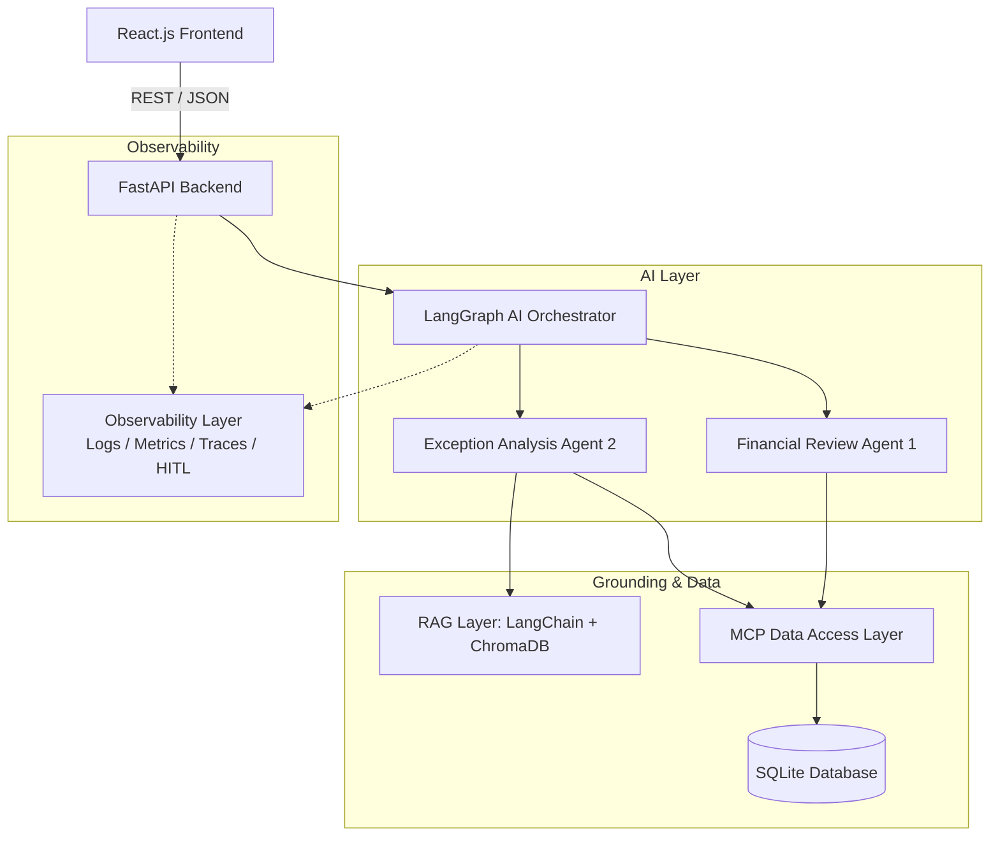

# ClosureIQ System Architecture

## Architecture Overview

## Key Architectural Principles
1. **Deterministic Financial Truth**: Financial math is done in the Python financial engine, not LLMs.
2. **Exactly Two AI Agents**: Financial Review Agent and Exception Analysis Agent.
3. **Human-in-the-Loop (HITL)**: Recommendations require human sign-off.
4. **MCP Controlled Access**: Database is accessed via secure tool interfaces.
5. **RAG Policy Grounding**: Recommendations cite accounting SOPs.
6. **Observability**: Complete audit trail of run IDs, tokens, latencies, and decisions.
