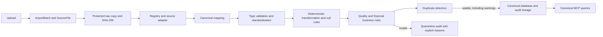

# Financial ingestion pipeline

[Project entry point](../../README.md) | [Architecture and setup](../architecture/overview.md) | [Ingestion](pipeline.md)

**Status: implemented backend; browser upload/mapping screens planned.** Examples are explicitly synthetic demo data, never real ERP evidence.

## Financial-file upload/import - Implemented backend; React UI planned

`POST /api/v1/imports/upload` accepts CSV/Excel bytes (up to 25 MiB), filename/source/organization query parameters and JSON adapter options in `X-Import-Options`. The same path is available through `IngestionService.ingest_file` or `ingest_path`. Register source systems, bank accounts and reviewed account mappings explicitly; ingestion does not invent account masters. Sources: [upload route](../../backend/app/api/routes/imports.py), [service](../../backend/app/ingestion/service.py).



Financial row parsing/mapping/persistence is bounded by configurable chunks (default 500). Raw bytes remain size-limited in memory; OOXML uses read-only worksheets and binary XLS uses xlrd. Original files are never edited. Audit events preserve source-file/sheet/row references, control rows, warnings and quarantine reasons. A parse failure rolls back the file's canonical records while retaining raw evidence; row persistence failures use savepoints. The contracts and limitations follow below.

HTTP: `POST /api/v1/imports/upload?filename=demo.csv&source_system_id=<id>&organization_id=<org>` with the CSV/Excel bytes as the request body (`Content-Type: text/csv` or `application/octet-stream`). Optional `adapter_key` and `batch_id` query parameters select an adapter/bind a batch. Send canonical context such as `{"bank_account_id":"...","currency_code":"KES"}` in the `X-Import-Options` header. This is a raw-body upload, not multipart; browser screens are still future work.

Use a dedicated session for `IngestionService.ingest_file`/`ingest_path`. Sources must belong to the organization, account mappings must be reviewed/auto-mapped, and independent bank statements require a bank master linked to a canonical GL account. Do not use the destructive `scripts/seed_database.py` against imported data.

## Phase 2 implementation contract

Entry points: [upload API](../../backend/app/api/routes/imports.py), `IngestionService.ingest_file(db, file_bytes, filename, ...)`, and `ingest_path(db, path, ...)`. Use a dedicated SQLAlchemy session. Existing source systems must be active and belong to the supplied organization; existing batches must match both source and organization. The service can create a generic runtime source when called without an ID, but the HTTP route requires a registered source ID.

### Adapters and detection

| Key | Supported input and mapping |
|---|---|
| `enquest_ledger` | OOXML including renamed `.xls`, and binary XLS; normalized headers across sheets, Excel dates, optional Remarks, row roles and separate posting amounts. Filename account identity requires a mapping. |
| `enquest_tb` | Excel TB Account/Opening/Debit/Credit/Closing columns, indented group controls, caller-supplied `fiscal_period` and `currency_code`. |
| `generic_bank` | CSV/Excel with exact normalized aliases; signed amount or deposit/withdrawal columns. Positive deposit, negative withdrawal; simultaneous nonzero sides are rejected as ambiguous rather than silently netted. Requires `bank_account_id` and currency in data/options. |
| `generic_ap_invoice` | CSV/Excel vendor/code, invoice/date/due date, subtotal/tax/total/paid/outstanding and status. Missing vendor/invoice IDs are errors, not generated placeholders. |
| `generic_fixed_asset` | CSV/Excel asset code/name/category, acquisition/in-service dates, cost/salvage/life/method/accumulated depreciation. Explicit month/year headers or `useful_life_unit` for ambiguous Useful Life; no magnitude-based unit guesses. |

Detection reads worksheet/CSV headers, not compressed ZIP text or filename keywords. Automatic detection scans up to 100 rows per sheet; explicit adapter selection parses the full file. CSV input is UTF-8/UTF-8-BOM with comma delimiters. Unsupported/malformed input has a failed file summary and retained raw evidence. Sources: [registry](../../backend/app/ingestion/adapters/registry.py), [tabular utilities](../../backend/app/ingestion/adapters/tabular.py), [adapters](../../backend/app/ingestion/adapters).

### Validation, standardization and transformation

The [shared pipeline](../../backend/app/ingestion/pipeline.py) operates on canonical payloads. It validates dates, finite Decimals, amount precision/range, positive exchange rates, strings/identifiers, positive integer fields and booleans. It normalizes whitespace, currency aliases (`Rs`/`rs.` → `PKR`), ISO casing, supported entity statuses, categories and depreciation-method spelling. `value_replacements` and `defaults` are explicit, per-entity constructor configuration; no Enquest mappings are embedded in the service.

Required identifiers and non-null monetary fields are validated. Unknown optional dates remain null; missing transaction dates never become today's date. Missing money never becomes zero automatically. Missing subtotal/outstanding/book value may be derived only from known operands. A caller can supply deliberate defaults through an injected pipeline; those defaults must reflect an approved source contract. Zero is preserved as a value, not treated as missing. Amounts exceeding canonical precision are rejected instead of silently rounded; derived base journal amounts use explicit four-place Decimal rounding. Excel binary numeric representation can still carry source artifacts, which may need a reviewed source normalization policy.

Other deterministic transformations include journal reporting period, source/batch/file context, bank direction, and adapter-level column combination/splitting. There are no AI anomaly/fraud scores in ingestion.

### Financial rules and quarantine policy

| Outcome | Examples |
|---|---|
| Error → quarantine | `ERR_INVALID_DATE`, `ERR_INVALID_AMOUNT`, `ERR_AMOUNT_PRECISION`, `ERR_MISSING_FIELD`, `ERR_MISSING_ACCOUNT`, `ERR_NEGATIVE_AMOUNT`, `ERR_UNBALANCED_JOURNAL`, invalid integers/booleans/status/currency, missing/out-of-scope bank/account references. |
| Warning → retain record | `WARN_DUAL_SIDED_POSTING`, `WARN_POTENTIAL_BUSINESS_DUPLICATE`, `WARN_AP_DATE_INCONSISTENCY`, `WARN_ASSET_DATE_INCONSISTENCY`, invoice total/overpayment, asset salvage, TB control and base-amount discrepancies. |
| Partial journal → draft + warning | `WARN_INCOMPLETE_JOURNAL`: an account-ledger extract is not a complete voucher. The single posting remains DRAFT; no balancing counterpart is fabricated. Complete journals must balance exactly. |

Quarantine is represented by `INGEST_QUARANTINED` audit events, not duplicate financial models or an invalid-row financial table. `INGEST_CONTROL`, `INGEST_IMPORTED` and `INGEST_FILE_FAILED` events retain controls, successful record IDs and file failures. Audit details carry file/sheet/row lineage; imported payloads retain pre-standardization source context. Logs contain status/counts only, not financial row contents or SQL parameter dumps.

### Duplicates, persistence and summary

- **Technical file duplicate:** SHA-256 within the same source/organization and an already PARSED/QUARANTINED file returns `DUPLICATE`, with the existing batch/file IDs and no second import. Different sources are distinct import contexts. This protects replay even when the uploaded filename changes.
- **Technical row duplicate:** the same file/sheet/physical row identity within an import is skipped and counted. Different physical rows with identical financial values are not silently removed.
- **Business duplicate:** organization-scoped fingerprints compare persisted ingestion audit records, including previous chunks/files. Repeated vendor/invoice keys or similar bank/journal/asset fingerprints remain imported with `WARN_POTENTIAL_BUSINESS_DUPLICATE`. This is a review hint, not a fraud determination, and does not retroactively scan manually inserted legacy records.
- **Persistence:** reuses the Phase 1 journal, bank, AP, asset and TB models. Per-row savepoints isolate persistence failures; a late parse failure rolls back the file's financial records. Source data remains available for investigation.
- **Summary:** exposes `total_rows`, `valid_rows`, `quarantined_rows`, `warning_rows`, `duplicate_files`, `technical_duplicate_rows`, `business_duplicate_rows`, `skipped_rows`, `source_file_id` and `status`. Counts refer to mapped transaction rows; controls are skipped separately. Batch totals accumulate across files, retaining PARTIAL status when any file has errors. Inline diagnostics are capped at 100 errors and 100 warnings; full row diagnostics remain in audit events. Statuses include COMPLETED, PARTIAL, QUARANTINED, FAILED and replay-only DUPLICATE.

Runtime raw copies use exclusive creation and path validation. This prevents service-level overwrite/path traversal; it is not OS-enforced WORM storage. The process lock serializes imports in the current single-worker deployment; cross-process duplicate races need database uniqueness/locking before scaling. Same-hash quarantined-file replay currently returns DUPLICATE; a controlled reprocessing workflow is not implemented. The input-byte cap and row chunks bound routine processing, but binary workbook libraries can retain workbook structures in memory.

Legacy model definitions remain for compatibility, but downstream MCP now queries canonical financial tables only. Close engines and agents receive canonical tool output and contain no Enquest header/layout logic. The existing engines still use floats and the workflow still accepts supplied accrual/depreciation inputs; Phase 2 does not claim to complete those later integrations. Reproducible synthetic examples and verification results follow below.

## Implemented Enquest mapping, keeping the schema generic

Enquest header/layout/account-identity handling stays inside [Enquest adapters](../../backend/app/ingestion/adapters). Shared service/pipeline code handles canonical names only. The registry uses content/header detection or an explicit key; invalid explicit keys do not fall back. No new ERP-specific database models were added.

| Source element | Canonical destination |
|---|---|
| Filename stem | `account_name_raw`, resolved through source-scoped `SourceAccountMapping` in REVIEWED/AUTO_MAPPED state. No account auto-creation. |
| Voucher date/type/number | Journal entry date, type and external ID/number. Missing posting date remains null. |
| Ref/particulars/optional Remarks | Header reference/description; particulars and remarks can be deterministically combined. |
| Debit/credit, balance, currency/rate | Separate Decimal debit/credit, source running balance, currency/rate; base amounts derive from rate with explicit four-place rounding. No ingestion netting. |
| Cheque/CUIN-FDA/source reconciled marker | Line dimensions and original raw lineage. `is_reconciled` remains false. |
| Opening/subtotal/total/footer rows | Control audit events, excluded from journal lines. |
| Ledger transaction row | One explicitly partial DRAFT journal extract, not an invented balanced voucher. Cross-file journal reconstruction remains future work. |
| Trial balance account/Opening/Debit/Credit/Closing | Canonical TB record after mapping, configured fiscal period/currency and validation. Indented parent groups and All Account rows remain controls. Blank money is not inferred as zero. |
| Bank/AP/asset exports | Generic adapters write bank transactions, AP invoices and fixed assets using canonical fields and explicit master references. |

Lineage flows through `ImportBatch`/`SourceFile` to `JournalEntry`/`JournalLine`; other domain records link to batches, with detailed file/sheet/row-to-record references in `AuditEvent`. Source values remain in immutable raw files and audit lineage. See [service](../../backend/app/ingestion/service.py), [pipeline](../../backend/app/ingestion/pipeline.py).

## Selected Enquest files and data provenance

The local selection contains **18 `.xls` files**. All **17 ledger exports were inspected as ZIP/OOXML workbooks despite their extensions**. They contain Ledger Inquiry/Voucher Wise report headings, ledger name/report period, opening rows, postings and debit/credit footer totals. Headers include Voucher Date, Particulars, Voucher Type, Voucher No, Ref No, Cheque No, Curr., Ex.Rate, Debit Amount, Credit Amount, Balance Amount, Is Bank Reconciliated and CUIN/FDA; some posting rows contain additional narration. Numeric Excel dates and floating-point-looking XML amount strings need explicit normalization. The Prime Bank heading covers 1 January–31 December 2025.

| Folder under `data/raw/enquest/` | Selected files | Evidence supported |
|---|---|---|
| `trial_balance/` | `Enquest TB 2025.xls` | Binary XLS decoded read-only with xlrd: Account/Opening/Debit/Credit/Closing headers, All Account control and indented groups/leaves. Report heading is 1 January-31 December 2025; this is a limited structural sample, not a completeness certification. |
| `bank_gl/` | `DIAMOND TRUST BANK KSHS.xls`; `DIAMOND TRUST BANK-KES CREDIT CARD.xls`; `PRIME BANK KSHS.xls` | ERP bank/cash postings and source reconciliation markers, **not independent bank statements**. |
| `accruals/` | `Accrual Expenses.xls`; `ACCRUALS-AUDIT FEES.xls` | Accrual postings/openings and invoice movements, not a complete obligation schedule/AP register. |
| `fixed_assets/` | `F-A COST MOTOR VEHICLES.xls`; `F-A COST OFFICE EQUIPMENT.xls`; `F-ACOST COMPUTERS & ACCESSORIES.xls` | Category cost ledgers; office equipment has an opening balance, not an itemized register. |
| `accumulated_depreciation/` | `ACC.DEP.COMPUTERS & ACCESSORIES.xls`; `ACC.DEP.MOTOR VEHICLES.xls`; `ACC.DEP.OFFICE EQUIPMENT.xls` | Category accumulated-depreciation postings and balances. |
| `depreciation_expense/` | `DEPRECIATION - MOTOR VEHICLES.xls`; `DEPRECIATION-COMPUTERS & ACCESSORIES.xls`; `DEPRECIATION-OFFICE EQUIPMENT.xls` | Category expense postings/recurring depreciation voucher references, not asset useful lives. |
| `counterpart_ledgers/` | `ASIF AMIN AC.xls`; `EXCHANGE GAIN-LOSS-REALISED.xls`; `OFFICE RENT EXPENSES.xls` | Selected counterpart, realized FX and rent context, not every voucher counterpart. |

These are **structural samples** for export formats, references, dates/amounts and account naming. Presence does not establish completeness, independent corroboration, authenticity certification or successful import. Some depreciation particulars/narration appear reused across categories; preserve and review those differences instead of inferring asset identity. They are not a complete verified close dataset. Source paths are listed in the table; raw files are locally ignored and were not changed.

Missing supporting data: independent bank statements and control balances; complete GL/COA and voucher counterparts; confirmed period/currency/rate semantics; AP invoices/service dates and recurring accrual expectations/prior-period baselines; an itemized asset register with acquisition/in-service dates, useful lives, salvage, disposals and prior depreciation; organization-approved policies and known expected outcomes.

**Synthetic demo data is planned** in `data/financial/`, with smaller fixtures in `data/sample/`; both currently contain only `.gitkeep`. Future fixtures should supply clearly synthetic bank statements, AP/baselines, asset schedules and controlled exceptions. Use separate source-system/batch identities and visible “SYNTHETIC DEMO” labels; this is a proposed provenance convention, not an implemented schema flag. Never present generated records as real ERP evidence. Existing tests use synthetic fixtures, and the tracked policy is sample material. The seed script inserts no records. Sources: [financial placeholder](../../data/financial/.gitkeep), [sample placeholder](../../data/sample/.gitkeep), [tests](../../backend/tests), [policy](../../data/policies/sample_accounting_policy.md), [seed](../../scripts/seed_database.py).

## A reproducible synthetic service example

Run the following Python from `backend/` after installing requirements. It creates an isolated in-memory database and temporary raw storage, not the project's working database:

```python
from pathlib import Path
from tempfile import TemporaryDirectory
from sqlalchemy import create_engine
from sqlalchemy.orm import Session
from app.database.database import Base
from app.database.models import SourceSystem, Account, BankAccount, AuditEvent
from app.ingestion.service import IngestionService
from app.ingestion.storage import RawStorageManager

engine = create_engine("sqlite:///:memory:")
Base.metadata.create_all(engine)
data = (
    "Booking Date,Amount,Reference,Currency\n"
    "2025-01-01,10,DEMO-1,KES\n"  # valid
    "2025-01-01,10,DEMO-1,KES\n"  # potential business duplicate: retained
    "invalid-date,20,DEMO-2,KES\n"  # quarantined
    "2025-01-02,30,DEMO-3,KES\n"  # valid
).encode()

with TemporaryDirectory() as directory, Session(engine) as db:
    db.add(SourceSystem(id="demo-source", organization_id="demo",
        adapter_key="generic_bank", source_type="BANK", display_name="SYNTHETIC DEMO"))
    db.add(Account(id="demo-gl", organization_id="demo", account_code="1010",
        account_name="Demo cash", normalized_name="demo_cash", account_type="ASSET",
        currency_code="KES"))
    db.flush()
    db.add(BankAccount(id="demo-bank", organization_id="demo", bank_name="Demo",
        account_number_masked="***0001", account_name="Demo account",
        linked_gl_account_id="demo-gl", currency_code="KES"))
    db.commit()
    service = IngestionService(storage=RawStorageManager(str(Path(directory) / "raw")), chunk_size=2)
    options = {"bank_account_id": "demo-bank"}
    result = service.ingest_file(db, data, "demo.csv", organization_id="demo",
        source_system_id="demo-source", options=options)
    assert (result.total_rows, result.valid_rows, result.quarantined_rows) == (4, 3, 1)
    assert result.status == "PARTIAL" and result.business_duplicate_rows == 1
    assert result.warning_rows == 1
    replay = service.ingest_file(db, data, "renamed.csv", organization_id="demo",
        source_system_id="demo-source", options=options)
    assert replay.status == "DUPLICATE" and replay.duplicate_files == 1
    assert replay.source_file_id == result.source_file_id
    events = db.query(AuditEvent).filter_by(import_batch_id=result.batch_id).all()
    assert any(e.event_type == "INGEST_QUARANTINED" for e in events)
engine.dispose()
```

The same scenarios are exercised by [service integration tests](../../backend/tests/ingestion/test_service_integration.py), including the HTTP upload route, foreign-key enforcement, raw-byte/hash identity, row/file rollback, bounded chunks, organization/currency validation and canonical MCP consumption.

## Record outcomes and lineage

| Scenario | Outcome and evidence |
|---|---|
| Valid bank row | Imported `BankTransaction`; batch counter increments and `INGEST_IMPORTED` contains its canonical record ID and file/sheet/row identity. |
| Warning row | For example, an AP due date before invoice date remains imported with `WARN_AP_DATE_INCONSISTENCY`. Dual-sided ledger amounts remain separate with `WARN_DUAL_SIDED_POSTING`. |
| Quarantined row | Invalid dates yield `ERR_INVALID_DATE`; unmapped accounts yield `ERR_MISSING_ACCOUNT`. No invalid financial row is inserted. `INGEST_QUARANTINED` points to the immutable raw row and its explicit reasons. |
| Technical duplicate | Re-uploading identical bytes in the same source context returns the original batch/file identity and DUPLICATE. A repeated file/sheet/physical-row identity is skipped/counted. |
| Potential business duplicate | Repeated vendor/invoice keys or matching financial fingerprints are retained with `WARN_POTENTIAL_BUSINESS_DUPLICATE`, including across chunks/files. This is not a fraud score. |

For Enquest ledger import, create `SourceAccountMapping(source_system_id=..., source_account_key="ledger", account_id=..., mapping_status="REVIEWED")` before uploading `ledger.xls`. The adapter derives `ledger` from the filename, then the generic service resolves the mapping. Lineage is `ImportBatch → SourceFile → JournalEntry → JournalLine`. Line dimensions preserve source reconciliation text, CUIN/FDA, cheque and raw descriptions; source “Yes” never sets ClosureIQ's reconciliation flag.

A ledger row is explicitly a partial journal extract: it stays DRAFT with `WARN_INCOMPLETE_JOURNAL` when unbalanced. Complete canonical journals must balance exactly or receive `ERR_UNBALANCED_JOURNAL`. Neither missing dates nor balancing counterparts are fabricated. Opening balances, subtotals and totals are stored as control audit references, not journal lines. TB parent/group rows are likewise excluded from account-level records.

Missing monetary fields required by the canonical model are rejected unless deterministically derivable from known values or supplied through explicit configured defaults. For AP, provide total/tax/subtotal and paid/outstanding values (subtotal and outstanding can be derived from known operands). For assets, provide cost, salvage and accumulated depreciation; book value can derive from cost minus accumulated depreciation. Use explicit life units. Missing bank amount, source currency or account mappings must be corrected, not guessed.

## Verification and limits

Verification recorded for Phase 2 commit `6083bb8`: **120 ingestion tests passed** (6.43 seconds), then **317 complete backend tests passed** (28.91 seconds). Each run reported the existing Starlette/AnyIO deprecation warning. Commands from `backend/`:

```powershell
$env:DATABASE_URL = 'sqlite:///:memory:'
$env:CHROMA_PERSIST_DIRECTORY = './chroma_data/phase2-tests'
.\.venv\Scripts\python.exe -m pytest tests/ingestion/ -v -p no:cacheprovider
.\.venv\Scripts\python.exe -m pytest -q -p no:cacheprovider
```

Use a valid ignored Chroma directory: the existing environment-variable handling does not interpret `:memory:` as ephemeral on Windows. The existing Starlette/AnyIO `BlockingPortal` deprecation warning is unrelated to Phase 2. Spreadsheet requirements are openpyxl and xlrd. RAG tests may require a cached/downloaded embedding model and can take substantially longer than ingestion tests.

Read-only inspection detected and parsed all 18 selected local Enquest files, including OOXML workbooks mislabeled `.xls` and the binary trial balance. This verifies format/header handling, not full financial completeness or actual-company import/close correctness. The selected TB contains grouped, partly redacted structural rows with blank amounts; required nulls will need source review before import. No confidential/raw business fixture was added to Git.

Limits: 25 MiB input cap; CSV is UTF-8 comma-delimited; detection scans 100 rows per sheet (explicit adapters parse beyond that); binary workbooks can retain workbook structures; service-level exclusive raw-file creation is not WORM storage; the import lock is single-process; same-hash quarantined files currently replay as DUPLICATE rather than reprocess. Diagnostics are capped in returned summaries but fully retained per row in audit events. No database migration, cross-file voucher reconstruction, React upload UI, authenticated reviewer system, automatic AP/asset workflow extraction or ERP posting is claimed. MCP is canonical-only; existing legacy-only data needs migration/import. Close engines still use floats and date/period/approval durability limitations remain as documented in the [architecture guide](../architecture/overview.md).

These results were recorded during Phase 2 implementation; this documentation reorganization does not rerun the application suite.

## Phase 2 implementation history

The handoff attributed `base.py`, `storage.py`, five adapters, the registry and the openpyxl requirement to earlier Gemini work, and package initializers, `pipeline.py`, `service.py` and adapter tests to Claude. Those files were present but uncommitted. Git cannot independently verify per-model authorship. The existing README was comprehensive, but still described financial ingestion as planned.

The initial files were syntactically complete, including 26 adapter tests; no truncated function was found. However, detection searched compressed bytes, parsing failures could look like empty success, financial values/dates/IDs were silently defaulted, storage could overwrite/traverse paths, account resolution ignored mappings and invented EXPENSE accounts, all rows were materialized, and row persistence had no safe rollback boundary. Pipeline/service integration tests were absent. These were implementation defects rather than a reason to discard the interfaces, models or useful tests.

Codex preserved those interfaces and the Phase 1 models, corrected defective paths, added reusable tabular readers and explicit validation, completed ingestion/audit persistence, added the upload route, moved MCP queries to canonical data, and extended the tests. Two incorrect test expectations were corrected: malformed TB parsing now raises an explicit error, and ambiguous useful-life units require explicit configuration instead of a numeric heuristic. Existing MCP/workflow assertions remain; their synthetic fixtures now populate canonical models. Legacy model compatibility remains tested by the Phase 1 database suite.
