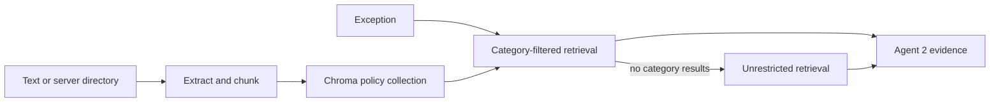

# Policy ingestion and retrieval

[Project entry point](../../README.md) | [Architecture and setup](../architecture/overview.md) | [Ingestion](../ingestion/pipeline.md)

## Policy upload/RAG — Partial end to end; backend implemented

1. Submit JSON text to `POST /api/v1/rag/ingest/text`, or ingest a server directory through `/rag/ingest/directory` or `scripts/ingest_policies.py`. No browser file-upload UI or multipart upload endpoint exists.
2. Extract text/metadata and split sections/paragraphs with defaults of 600 characters and 80-character overlap. Delete existing chunks for the same `doc_id`, then index new chunks in Chroma.
3. `/rag/query` retrieves top-k evidence with an optional category filter and formatted citations. `/rag/documents` lists documents; `DELETE /rag/documents/{doc_id}` removes chunks.
4. The workflow retrieves three results per exception; an empty category search falls back to unrestricted retrieval. Evidence is passed to Agent 2 per exception.

Directory ingestion recognizes Markdown/text, PDF and DOC/DOCX extensions. PDF/Word extraction needs optional `pypdf`/`docx` packages not declared in requirements; missing imports trigger limited printable-text fallbacks. Reliable OCR/binary document extraction is not established. Same-ID replacement is not global content deduplication or immutable policy versioning. The tracked policy is sample material, not verified company policy. Sources: [ingestion](../../backend/app/rag/ingestion.py), [vectorstore](../../backend/app/rag/vectorstore.py), [retriever](../../backend/app/rag/retriever.py), [routes](../../backend/app/api/routes/rag.py), [sample policy](../../data/policies/sample_accounting_policy.md).

## Storage and workflow integration

Repository policies live in `data/policies/`. Run `python ../scripts/ingest_policies.py` from `backend/` with `CHROMA_PERSIST_DIRECTORY` configured. The direct Chroma client persists the `accounting_policies` collection with cosine distance and default Chroma embeddings. Embeddings may require a model download. LangChain dependencies are declared, but the implemented retrieval path is not a LangChain chain.

Agent 2 receives evidence per exception. Empty evidence returns manual review without its model call; invalid citations/schema or provider failures become workflow errors. Citation validity does not certify accounting correctness. Policies in the repository are samples, not verified company evidence. See [agent behavior](../agents/specifications.md).

The prior guide's claims of verified corporate policies and complete policy metadata were aspirational. Immutable policy versioning, reliable binary extraction/OCR and authenticated server-directory access remain unfinished. For Windows tests, use an ignored directory such as `./chroma_data/phase2-tests`; `:memory:` passed through the environment is not handled as ephemeral storage. See [verification](../architecture/overview.md#tests-and-verification-evidence) and [RAG tests](../../backend/tests/rag/test_rag.py).
