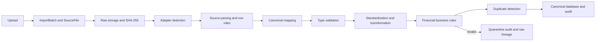

# ClosureIQ Phase 2 walkthrough

Phase 2 continues the existing work on `feature/generic-financial-database`; it does not restart the project. This tracked walkthrough accompanies the [main project documentation](README.md). All examples below are **synthetic demo data**, never real ERP evidence.

## What was already present

The handoff attributed `base.py`, `storage.py`, five adapters, the registry and the openpyxl requirement to earlier Gemini work, and package initializers, `pipeline.py`, `service.py` and adapter tests to Claude. Those files were present but uncommitted. Git cannot independently verify per-model authorship. The existing README was comprehensive, but still described financial ingestion as planned.

The initial files were syntactically complete, including 26 adapter tests; no truncated function was found. However, detection searched compressed bytes, parsing failures could look like empty success, financial values/dates/IDs were silently defaulted, storage could overwrite/traverse paths, account resolution ignored mappings and invented EXPENSE accounts, all rows were materialized, and row persistence had no safe rollback boundary. Pipeline/service integration tests were absent. These were implementation defects rather than a reason to discard the interfaces, models or useful tests.

Codex preserved those interfaces and the Phase 1 models, corrected defective paths, added reusable tabular readers and explicit validation, completed ingestion/audit persistence, added the upload route, moved MCP queries to canonical data, and extended the tests. Two incorrect test expectations were corrected: malformed TB parsing now raises an explicit error, and ambiguous useful-life units require explicit configuration instead of a numeric heuristic. Existing MCP/workflow assertions remain; their synthetic fixtures now populate canonical models. Legacy model compatibility remains tested by the Phase 1 database suite.

## Practical flow



HTTP: `POST /api/v1/imports/upload?filename=demo.csv&source_system_id=<id>&organization_id=<org>` with the CSV/Excel bytes as the request body (`Content-Type: text/csv` or `application/octet-stream`). Optional `adapter_key` and `batch_id` query parameters select an adapter/bind a batch. Send canonical context such as `{"bank_account_id":"...","currency_code":"KES"}` in the `X-Import-Options` header. This is a raw-body upload, not multipart; browser screens are still future work.

Use a dedicated session for `IngestionService.ingest_file`/`ingest_path`. Sources must belong to the organization, account mappings must be reviewed/auto-mapped, and independent bank statements require a bank master linked to a canonical GL account. Do not use the destructive `scripts/seed_database.py` against imported data.

## A reproducible synthetic service example

Run the following Python from `backend/` after installing requirements. It creates an isolated in-memory database and temporary raw storage, not the project's working database:

```python
from pathlib import Path
from tempfile import TemporaryDirectory
from sqlalchemy import create_engine
from sqlalchemy.orm import Session
from app.database.database import Base
from app.database.models import SourceSystem, Account, BankAccount, AuditEvent
from app.ingestion.service import IngestionService
from app.ingestion.storage import RawStorageManager

engine = create_engine("sqlite:///:memory:")
Base.metadata.create_all(engine)
data = (
    "Booking Date,Amount,Reference,Currency\n"
    "2025-01-01,10,DEMO-1,KES\n"  # valid
    "2025-01-01,10,DEMO-1,KES\n"  # potential business duplicate: retained
    "invalid-date,20,DEMO-2,KES\n"  # quarantined
    "2025-01-02,30,DEMO-3,KES\n"  # valid
).encode()

with TemporaryDirectory() as directory, Session(engine) as db:
    db.add(SourceSystem(id="demo-source", organization_id="demo",
        adapter_key="generic_bank", source_type="BANK", display_name="SYNTHETIC DEMO"))
    db.add(Account(id="demo-gl", organization_id="demo", account_code="1010",
        account_name="Demo cash", normalized_name="demo_cash", account_type="ASSET",
        currency_code="KES"))
    db.flush()
    db.add(BankAccount(id="demo-bank", organization_id="demo", bank_name="Demo",
        account_number_masked="***0001", account_name="Demo account",
        linked_gl_account_id="demo-gl", currency_code="KES"))
    db.commit()
    service = IngestionService(storage=RawStorageManager(str(Path(directory) / "raw")), chunk_size=2)
    options = {"bank_account_id": "demo-bank"}
    result = service.ingest_file(db, data, "demo.csv", organization_id="demo",
        source_system_id="demo-source", options=options)
    assert (result.total_rows, result.valid_rows, result.quarantined_rows) == (4, 3, 1)
    assert result.status == "PARTIAL" and result.business_duplicate_rows == 1
    assert result.warning_rows == 1
    replay = service.ingest_file(db, data, "renamed.csv", organization_id="demo",
        source_system_id="demo-source", options=options)
    assert replay.status == "DUPLICATE" and replay.duplicate_files == 1
    assert replay.source_file_id == result.source_file_id
    events = db.query(AuditEvent).filter_by(import_batch_id=result.batch_id).all()
    assert any(e.event_type == "INGEST_QUARANTINED" for e in events)
engine.dispose()
```

The same scenarios are exercised by [service integration tests](backend/tests/ingestion/test_service_integration.py), including the HTTP upload route, foreign-key enforcement, raw-byte/hash identity, row/file rollback, bounded chunks, organization/currency validation and canonical MCP consumption.

## Record outcomes and lineage

| Scenario | Outcome and evidence |
|---|---|
| Valid bank row | Imported `BankTransaction`; batch counter increments and `INGEST_IMPORTED` contains its canonical record ID and file/sheet/row identity. |
| Warning row | For example, an AP due date before invoice date remains imported with `WARN_AP_DATE_INCONSISTENCY`. Dual-sided ledger amounts remain separate with `WARN_DUAL_SIDED_POSTING`. |
| Quarantined row | Invalid dates yield `ERR_INVALID_DATE`; unmapped accounts yield `ERR_MISSING_ACCOUNT`. No invalid financial row is inserted. `INGEST_QUARANTINED` points to the immutable raw row and its explicit reasons. |
| Technical duplicate | Re-uploading identical bytes in the same source context returns the original batch/file identity and DUPLICATE. A repeated file/sheet/physical-row identity is skipped/counted. |
| Potential business duplicate | Repeated vendor/invoice keys or matching financial fingerprints are retained with `WARN_POTENTIAL_BUSINESS_DUPLICATE`, including across chunks/files. This is not a fraud score. |

For Enquest ledger import, create `SourceAccountMapping(source_system_id=..., source_account_key="ledger", account_id=..., mapping_status="REVIEWED")` before uploading `ledger.xls`. The adapter derives `ledger` from the filename, then the generic service resolves the mapping. Lineage is `ImportBatch → SourceFile → JournalEntry → JournalLine`. Line dimensions preserve source reconciliation text, CUIN/FDA, cheque and raw descriptions; source “Yes” never sets ClosureIQ's reconciliation flag.

A ledger row is explicitly a partial journal extract: it stays DRAFT with `WARN_INCOMPLETE_JOURNAL` when unbalanced. Complete canonical journals must balance exactly or receive `ERR_UNBALANCED_JOURNAL`. Neither missing dates nor balancing counterparts are fabricated. Opening balances, subtotals and totals are stored as control audit references, not journal lines. TB parent/group rows are likewise excluded from account-level records.

Missing monetary fields required by the canonical model are rejected unless deterministically derivable from known values or supplied through explicit configured defaults. For AP, provide total/tax/subtotal and paid/outstanding values (subtotal and outstanding can be derived from known operands). For assets, provide cost, salvage and accumulated depreciation; book value can derive from cost minus accumulated depreciation. Use explicit life units. Missing bank amount, source currency or account mappings must be corrected, not guessed.

## Verification and limits

Final verification: **120 ingestion tests passed** (6.43 seconds), then **317 complete backend tests passed** (28.91 seconds). Each run reported the existing Starlette/AnyIO deprecation warning. Commands from `backend/`:

```powershell
$env:DATABASE_URL = 'sqlite:///:memory:'
$env:CHROMA_PERSIST_DIRECTORY = './chroma_data/phase2-tests'
.\.venv\Scripts\python.exe -m pytest tests/ingestion/ -v -p no:cacheprovider
.\.venv\Scripts\python.exe -m pytest -q -p no:cacheprovider
```

Use a valid ignored Chroma directory: the existing environment-variable handling does not interpret `:memory:` as ephemeral on Windows. The existing Starlette/AnyIO `BlockingPortal` deprecation warning is unrelated to Phase 2. Spreadsheet requirements are openpyxl and xlrd. RAG tests may require a cached/downloaded embedding model and can take substantially longer than ingestion tests.

Read-only inspection detected and parsed all 18 selected local Enquest files, including OOXML workbooks mislabeled `.xls` and the binary trial balance. This verifies format/header handling, not full financial completeness or actual-company import/close correctness. The selected TB contains grouped, partly redacted structural rows with blank amounts; required nulls will need source review before import. No confidential/raw business fixture was added to Git.

Limits: 25 MiB input cap; CSV is UTF-8 comma-delimited; detection scans 100 rows per sheet (explicit adapters parse beyond that); binary workbooks can retain workbook structures; service-level exclusive raw-file creation is not WORM storage; the import lock is single-process; same-hash quarantined files currently replay as DUPLICATE rather than reprocess. Diagnostics are capped in returned summaries but fully retained per row in audit events. No database migration, cross-file voucher reconstruction, React upload UI, authenticated reviewer system, automatic AP/asset workflow extraction or ERP posting is claimed. MCP is canonical-only; existing legacy-only data needs migration/import. Close engines still use floats and date/period/approval durability limitations remain as documented in README.

The local Phase 2 commit includes code, tests, README and this walkthrough. No push or PR is part of this task.
